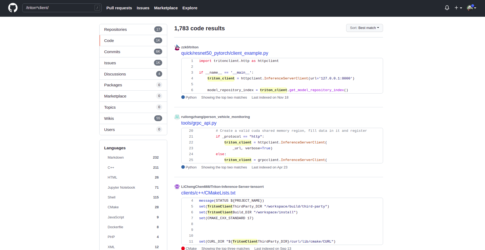

# Working Note

## GitHub Code Search

search code on GitHub

- Regular expressions are supported by surrounding them in slashes, for example `/git.*push/`
- To search for an exact string, use quotes. For example: "sparse index"

[more](https://cs.github.com/about/syntax)

## Github Shortcut Key

