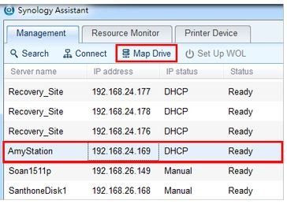
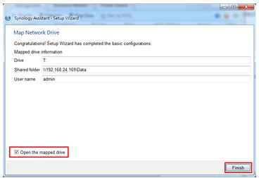
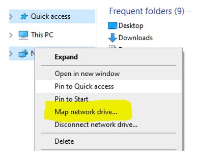

# IDE And Environment Setting

## Shortcut Key

### sublime text 3

Show/Hide sidebar: `Ctrl + K` and `Ctrl + B`

Duplicate lines: `Ctrl + Shift + D`

Goto line number: `Ctrl + G`

select word: `Ctrl + D`

select all of the word: `Alt + F3`

jump back: `Alt + -`

jump forward: `Alt + Shift + -`

upper case: `Ctrl + KU`

lower case: `Ctrl + KL`

[referece](https://gist.github.com/mrliptontea/4c793ebdf72ed145bcbf)

[//]: # (go to method:<kbd>Ctrl</kbd>+<kbd>R</kbd>)

### Vim 

Delete character: `x`

go to 2nd line: `:2`

add: `a` or `A`

move down: `j`

move up: `k`

move left: `h`

move right: `l`

go bottom: `G`

go top: `gg`

add a line(below): `o`

add a line(above): `O`

go to next word: `w`

go back last word: `b`

delete word: `dw`

delete rest of line: `D`

delete rest of line and insert: `C`

deletl to char a: `dta`

### Qt Creator

Stop Debugging: `Shift + F5`

Next Bookmark: `Ctrl + .`

Previous Bookmark: `Ctrl + ,`

Show/Hide side menu: `Alt + 0`

## Synology NAS Setting

### Connect NAS to Windows Computer

Step 1: 
Install SYNOLOGY assistant in Windows

Step 2: 
Connect to your Synology NAS on your Windows computer using Synology Assistant.



Step 3:
Synology Assistant Setup Wizard



Step 4:
Synology NAS Folders directly from Windows Explorer 



[reference](https://www.itblock.sg/post/easysynologynaswindowssetup)


## Environment Setting

### Set Python3 Build

step 1:
In sublime text 3, select `Tools -> Build System -> New Build System`

step 2: 
find your python3 path, maybe you can use `which` command to find.

```console
$ which python3
```
in my case, my path is */usr/bin/python3*

step 3:
then, add following code:
```plain
{
 "cmd": ["/usr/bin/python3", "-u", "$file"],
 "file_regex": "^[ ]File \"(...?)\", line ([0-9]*)",
 "selector": "source.python"
}
```
step 4:
save as: `py3.sublime-build`

step 5:
select, `Tools -> Build System -> py3`

and run your code using `Ctrl+B`

## Go 

Variable Declaration
```go
	var i int =10
	fmt.Printf("%v, %T\n", i, i)
```
or
```go
    i:=10
```

> Can't redeclare variables, but can shadow them
> variables must be used

Const
```go
	const a = 10
```
or
```go
const (
    a = 1
    b = 2 
    c = 3 
)
```

Array
```go
grades := [3]int{100, 60, 70}
fmt.Printf("grade: %v", grades)
```
or
```go
var names [3]string
names[0] = "Tim"
names[1] = "Tom"
names[2] = "Bob"
```

2D Array
```go
var mask [3][3]int
mask[0] = [3]int{1,0,1}
mask[1] = [3]int{0,1,0}
mask[2] = [3]int{0,0,1}
```

## Check GPU

```console
$ sudo lshw -C display
```


## Install cuDNN: 7.6.5 in Ubuntu 18.04 (x64)

Debian Installation:

1. [Download](https://developer.nvidia.com/rdp/cudnn-archive) `cuDNN Runtime Library for Ubuntu18.04 (Deb)`, `cuDNN Developer Library for Ubuntu18.04 (Deb)`, `cuDNN Code Samples and User Guide for Ubuntu18.04 (Deb)`

2. Install 

Install runtime:
```console
$ sudo dpkg -i libcudnn7_7.6.5.32-1+cuda10.2_amd64.deb
```
Install developer library:
```console
$ sudo dpkg -i libcudnn7-dev_7.6.5.32-1+cuda10.2_amd64.deb
```
Install code samples 
```console
$ sudo dpkg -i libcudnn7-doc_7.6.5.32-1+cuda10.2_amd64.deb
```

[reference](https://docs.nvidia.com/deeplearning/cudnn/install-guide/index.html#installlinux-deb) 

##  Install TensorRT

### Install TensorRT 7.0 in Ubuntu 18.04 (x64)

1. [Download](https://developer.nvidia.com/compute/machine-learning/tensorrt/secure/7.0/7.0.0.11/local_repo/nv-tensorrt-repo-ubuntu1804-cuda10.2-trt7.0.0.11-ga-20191216_1-1_amd64.deb) 

2. Install

```console
$ sudo dpkg -i nv-tensorrt-repo-ubuntu1804-cuda10.2-trt7.0.0.11-ga-20191216_1-1_amd64.deb
$ sudo apt-key add /var/nv-tensorrt-repo-${tag}/7fa2af80.pub
$ sudo apt-get update
$ sudo apt-get install tensorrt libcudnn7
```
using Python 3:
```console
$ sudo apt-get install python3-libnvinfer-dev
```

Use TensorRT with TensorFlow:
```console
$ sudo apt-get install uff-converter-tf
```

Verify the installation:
```console
$ dpkg -l | grep TensorRT
```

[reference](https://docs.nvidia.com/deeplearning/tensorrt/archives/tensorrt-700/tensorrt-install-guide/index.html#installing-debian)

---

## Uninstall TensorRT

Step 1: Uninstall libnvinfer7 which was installed using the Debian:
```console
$ sudo apt-get purge "libnvinfer*"
```

Step 2: Uninstall uff-converter-tf, graphsurgeon-tf, and onnx-graphsurgeon which were also installed using the Debian
```console
$ sudo apt-get purge graphsurgeon-tf onnx-graphsurgeon
```

Step 3: Uninstall the Python TensorRT wheel file
If using Python 3.x:
```console
$ sudo pip3 uninstall tensorrt
```

Step 4: Uninstall the Python UFF wheel file
If using Python 3.x:
```console
$ sudo pip3 uninstall uff
```

Step 5: Uninstall the Python GraphSurgeon wheel file
If using Python 3.x:
```console
$ sudo pip3 uninstall graphsurgeon
```

Step 6: Uninstall the Python ONNX GraphSurgeon wheel file
If using Python 3.x:
```console
$ sudo pip3 uninstall onnx-graphsurgeon
```


##  Install DeepStream 5.0

Nvidia said...
*You must install the following components: - Ubuntu 18.04 - GStreamer 1.14.1 - NVIDIA driver 450.51 - CUDA 10.2 - TensorRT 7.0.X*

Install dependencies:
```console
$ sudo apt install \
libssl1.0.0 \
libgstreamer1.0-0 \
gstreamer1.0-tools \
gstreamer1.0-plugins-good \
gstreamer1.0-plugins-bad \
gstreamer1.0-plugins-ugly \
gstreamer1.0-libav \
libgstrtspserver-1.0-0 \
libjansson4
```

[Download](https://developer.nvidia.com/assets/Deepstream/5.0/ga/secure/deepstream_sdk_5.0.1_amd64.deb) DeepStream 5.0 dGPU Debian package


Install `.deb` file
```console
$ sudo apt-get install ./deepstream-5.0_5.0.1-1_amd64.deb
```


[reference](https://docs.nvidia.com/metropolis/deepstream/dev-guide/text/DS_Quickstart.html#dgpu-setup-for-ubuntu)

### Uninstall DeepStream

Remove DeepStream 4.0 or later installations:
```console
$ cd /opt/nvidia/deepstream/deepstream/
$ PREV_DS_VER as 4.0
$ sudo ./uninstall.sh
```


## VS Code

### Python Interactive Mode

create an empty .py file and type:
```python
# %%
```

### VS Code Remote SSH Setting

**Local PC Setting**

Create your local SSH key pair:
```console
$ ssh-keygen -t rsa -b 4096
```

Connecting to a Linux SSH host:

```console
$ export USER_AT_HOST=user-name@hostname
$ export PUBKEYPATH=$HOME/.ssh/id_rsa.pub

$ ssh-copy-id -i "$PUBKEYPATH" "$USER_AT_HOST"
```

SSH file and folder permissions:
```console
$ chmod 700 ~/.ssh
$ chmod 600 ~/.ssh/config
$ chmod 600 ~/.ssh/id_rsa.pub
```

### Connect To A Remote Host In VS Code

Step 1: In VS Code, Command Palette (F1)

Step 2: Search  `Remote-SSH: Connect to Host` and Click

Step 3: Type `user@hostname`

---


## Anaconda

### Installation

[Download](https://docs.anaconda.com/anaconda/install/linux/) bash file, then install.

e.g.
```console
$ bash Anaconda3-2021.05-Linux-x86_64.sh
```

### Uninstall

Delete anaconda directory
```console
$ rm -rf ~/anaconda3
```

Remove conda path from `~./bash_profile`:

e.g. 
```console
$ export PATH="/Users/jsmith/anaconda3/bin:$PATH"
```
