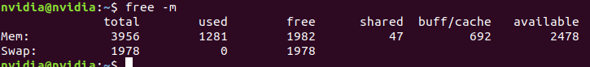
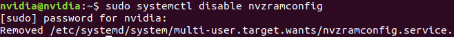
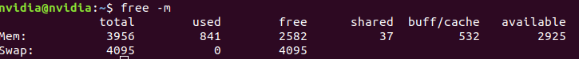

# Nvidia

## Jetson

### Jetson Tools

Install jtop:
```console
$ sudo pip3 install jetson-stats
```
Run:
```console
$ sudo jtop
```

### Install pygame
python2 version pygame
```console
$ sudo apt update
$ sudo apt install python-pygame
```

python3 version pygame
```console
$ sudo apt update
$ sudo apt install libsdl-dev libsdl-image1.2-dev libsdl-mixer1.2-dev libsdl-ttf2.0-dev
$ sudo apt install libsmpeg-dev libportmidi-dev libavformat-dev libswscale-dev
$ sudo apt install libfreetype6-dev
$ sudo apt install libportmidi-dev

$ sudo apt install python3-pip
$ pip3 install pygame==1.9.6
```
[more](https://qiita.com/karaage0703/items/5d43309bc688858e7c2a)

## TLT(Transfer Learning Toolkit) V3

### UNET

**convert model to engine**
```console
$ ./tlt-converter -k nvidia_tlt -e xxx.engine -t fp16 -p input_1,1x3x320x320,4x3x320x320,16x3x320x320 /model_dir/xxx.etlt
```


## TLT(Transfer Learning Toolkit) v2 command

### MaskRCNN TLT

**Train**
```console
$ tlt-train mask_rcnn -e maskrcnn_your_spec.txt -d model_out_dir --gpus 1 -k $YOUR_KEY
```

**Evaluate**
```console
$ tlt-evaluate mask_rcnn -e specs_file -m model.tlt -k $YOUR_KEY
```

**Inference**
```console
$ tlt-infer mask_rcnn -i /image-dir -o result/ -e spec_file -m model.tlt  -t 0.2 --include_mask -k $YOUR_KEY
```

## Jetson Nano Troubleshooting

###  Issue: Could not get EGL display connection

Solution:
1. Make sure DISPLAY is not set. Unset if necessary.
2. [Disable X11-forwarding.](https://miseon119.github.io/whylearn.github.io/test/mermaid.html#enable-or-disable-x11-forwarding-in-ssh-server)

[reference](https://forums.developer.nvidia.com/t/nano-nvbufsurftransform-could-not-get-egl-display-connection/81946)

---

## SD Card Backup & Restore

### Backup

Step 1: Check your SD card in your host Linux PC
```console
$ sudo parted -l
```
This command sample result:
> Model: Generic MassStorageClass (scsi)
Disk /dev/sdb: 31.9GB
Sector size (logical/physical): 512B/512B
Partition Table: msdos
Disk Flags: 

Number  Start   End     Size    Type     File system  Flags
 1      4194kB  31.9GB  31.9GB  primary  fat32        lba

Step 2: Check SD card unmount
```console
$ sudo umount /dev/your-sd-card
```
sample result:
> sudo umount /dev/sdb
umount: /dev/sdb: not mounted.

Step 3: save as image file
```console
$ sudo dd if=/dev/yourSdCard conv=sync,noerror bs=64K | gzip -c > ~/backup_nano.img.gz
```

### Restore

Step 1: 
```console
 $ sudo su
```

Step 2: 
```console
 $ gunzip -c ~/backup_nano.img.gz | dd of=/dev/YourSdCard bs=64K
```

---
## Swap memory for Jetson nano

Step 1: check current swap status.
```console
$ free -m
```


Step 2: Disable nvzram
```console
$ sudo systemctl disable nvzramconfig
```


Step 3: 
```console
$ sudo fallocate -l 4G /mnt/4GB.swap
$ sudo chmod 600 /mnt/4GB.swap
$ sudo mkswap /mnt/4GB.swap
```

Step 4: modifiy fstab file
```console
$ sudo vim /etc/fstab
```
Add this line,
```text
/mnt/4GB.swap swap swap defaults 0 0
```

