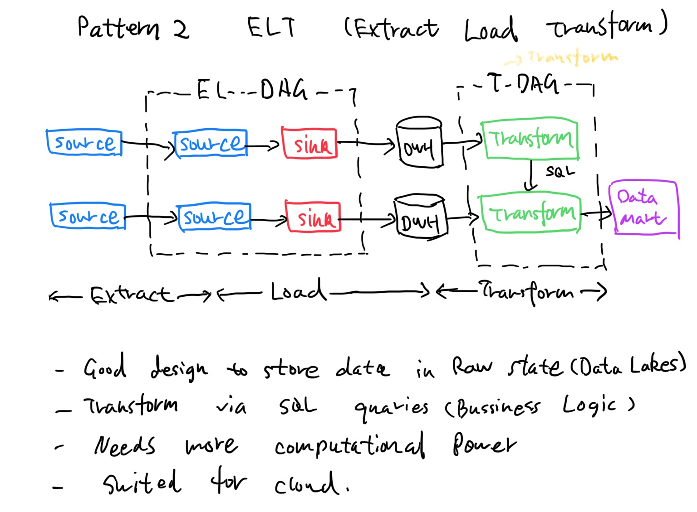

# System Design

## Cache System

Caching is a common technique  in modern computing to enhance   system performance and reduce response time. From the front end to the back end,   caching plays a crucial role in improving the  efficiency of various applications and systems. 

The most common hardware cache  are L1, L2, and L3 caches.

 - L1 cache is the smallest and fastest cache,  typically integrated into the CPU itself. It stores frequently accessed data  and instructions, allowing the CPU to   quickly access them without having  to fetch them from slower memory. 
 
 - L2 cache is larger but slower than L1 cache,   and is typically located on the  CPU die or on a separate chip.

 - L3 cache is even larger and slower than L2 cache,  and is often shared between multiple CPU cores. 

## Data Pipeline Design Patterns

## #Data Lake vs Data Warehouse vs Data Mart

### Design Pattern 

#### ETL Pattern

#### ELT Pattern

#### CDC Pattern

#### ETLT Pattern

