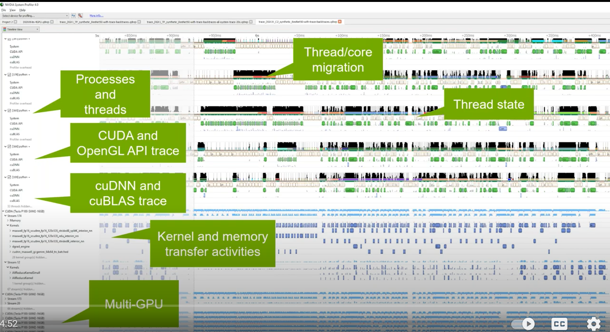

# Nvidia Developement

## Nsight Family


**Nsight Systems**: system-wide application algorithm tuning

**Nsight Compute**: Debug/optimize specific CUDA kernel

**Nsight Graphics**: Debug/optimize specific graphics

IDE Plugins:
- Nsight Eclipse Edition/Visual Studio

[more](https://drive.google.com/file/d/1Nsx1gW1aFgNtUInJ6IxiZa06CrZSgaVs/view?usp=sharing)

[more blog](https://developer.nvidia.com/blog/nsight-systems-exposes-gpu-optimization/)

### Nsight Systems
**NVIDIA Nsight Systems** provides developers with a more complete and unified view of how their applications utilize a computer’s CPUs and GPUs.

> Nsight Systems allows you to identify issues such as GPU starvation, unnecessary GPU synchronization, insufficient CPU parallelization or pipelining, and unexpectedly expensive CPU or GPU algorithms. 

Sample profile:


#### Command
Version Information
```console
$ nsys -v
```

Default analysis run
```console
$ nsys profile <application> [application-arguments]
```

> Effect: Launch the application using the given arguments. Start collecting immediately and end collection when the application stops. Trace CUDA, OpenGL, NVTX, and OS runtime libraries APIs. Collect CPU sampling information and thread scheduling information.

Limited trace only run
```console
$ nsys profile --trace=cuda, nvtx -d 20
    --sample=none --cpuctxsw=none -o my_test <application>
    [application-arguments]
```
`-d 20` : Start collecting immediately and end collection after 20 seconds or when the application ends.

> Trace CUDA and NVTX APIs. Do not collect CPU sampling information or thread scheduling information. 

Delayed start run
```console
$ nsys profile -e TEST_ONLY=0 -y 20
    <application> [application-arguments]
```

Collect ftrace events
```console
nsys profile --ftrace=drm/drm_vblank_event
    -d 20
```

> Effect: Collect ftrace drm_vblank_event events for 20 seconds. Note that ftrace event collection requires running as root. 

To get a list of ftrace events available from the kernel, run the following:
```console
$ sudo cat /sys/kernel/debug/tracing/available_events
```

E.g. profile a Python script that uses CUDA
```console
$ nsys profile --trace=cuda,cudnn,cublas,osrt,nvtx
    --delay=60 python <my_dnn_script.py>
```

> Effect: Launch a Python script and start profiling it 60 seconds after the launch, tracing CUDA, cuDNN, cuBLAS, OS runtime APIs, and NVTX as well as collecting thread schedule information.

#### Interactive CLI Command
Collect from beginning of application, end manually
```console
nsys start --stop-on-exit=false
nsys launch --trace=cuda,nvtx --sample=none <application> [application-arguments]
nsys stop
```

> Effect: Create interactive CLI process and set it up to begin collecting as soon as an application is launched. Launch the application, set up to allow tracing of CUDA and NVTX as well as collection of thread schedule information. Stop only when explicitly requested.

> If you start a collection and fail to stop the collection (or if you are allowing it to stop on exit, and the application runs for too long) your system’s storage space may be filled with collected data causing significant issues for the system. Nsight Systems will collect a different amount of data/sec depending on options, but in general Nsight Systems does not support runs of more than 5 minutes duration.

Run application, begin collection manually, run until process ends
```console
nsys launch -w true <application> [application-arguments]
nsys start
```

> Effect: Create interactive CLI and launch an application set up for default analysis. Send application output to the terminal. No data is collected until you manually start collection at area of interest. Profile until the application ends. 

[more](https://docs.nvidia.com/nsight-systems/UserGuide/index.html)

---

## NVIDIA Isaac Sim

> Isaac Sim is a *robotics simulation application* and *synthetic data generation tool*. Within Isaac Sim, you can program, train and test any robot design. The simulation environment enables the creation of photorealistic worlds filled with specific objects that the robot can interact with.


**New Features**

- Multi-Camera Support
- Fisheye Camera with Synthetic Data
- ROS2 Support
- PTC Onshape Importer
- Improved Sensor Support
  - Ultrasonic Sensor
  - Force Sensor
  - Custom Lidar Patterns
- Downloadable from NVIDIA Omniverse Launcher

**Synthetic Data Generation**

> Isaac Sim has built-in support for a variety of sensor types that are important in training perception models. These sensors include RGB, depth, bounding boxes, and segmentation.

> Output synthetic data in the KITTI format. This data can then be used directly with the NVIDIA Transfer Learning Toolkit to enhance model performance with use case-specific data.

[more](https://developer.nvidia.com/blog/nvidia-isaac-sim-on-omniverse-now-available-in-open-beta/)

[webinar link](https://www.nvidia.com/en-us/on-demand/session/gtcspring21-s31824/)

---

## NVIDIA VPI

> NVIDIA VPI is a library that abstracts heterogeneous video stream computing on NVIDIA embedded devices. VPI provides a common API to use various hardware modules for accelerating computer vision applications. 

> VPI supports the backends CPU, GPU (using CUDA), PVA (Programmable Vision Accelerator), VIC (Video and Image Compositor) and NVENC(Video encoder engine). 


| Backend | Device/platform |
|---------| ----------------|
| CPU | All devices on x86 (linux) and Jetson aarch64 platforms |
| CUDA | All devices on x86 (linux) with a Maxwell or superior NVIDIA GPU, and Jetson aarch64 platforms |
| PVA | All Jetson AGX Xavier series and Jetson Xavier NX devices |
| VIC | All Jetson devices. |
| NVENC | All Jetson devices. Noting that nvenc that has dense optical flow is only supported on Jetson AGX Xavier series. |


**New Features**
- Support for different processing backends
- VPI allows a combination of different backends in the same processing pipeline.
- Zero copy, shared memory mapping interface to manage data between the different backends.
- The API is designed to minimize initial memory allocations typically required just at the starting stage of many computer vision algorithms.
- OpenCV and EGL interoperability.
- Synchronization mechanisms that are agnostic of the backend being used.


**Jetpack**

Path: `/opt/nvidia/vpi/vpi-0.1`

**Example**


python
```python
import vpi
input = vpi.Image((640,480), vpi.Format.U8)
with vpi.Backend.CUDA:
    output = input.box_filter(3)
```

c++
```cpp
#include <vpi/Image.h>
#include <vpi/Stream.h>
#include <vpi/algo/BoxFilter.h>

int main()
{
    VPIImage input, output;
    vpiImageCreate(640, 480, VPI_IMAGE_FORMAT_U8, 0, &input);
    vpiImageCreate(640, 480, VPI_IMAGE_FORMAT_U8, 0, &output);

    //Create a stream to execute the algorithm. 
    VPIStream stream;
    vpiStreamCreate(0, &stream);
    
    //Submit the box filter algorithm to the stream
    vpiSubmitBoxFilter(stream, VPI_BACKEND_CUDA, input, output, 3, 3, VPI_BORDER_CLAMP);
    
    //Wait until the stream finishes processing.
    vpiStreamSync(stream);
    
    //Destroy created objects.
    vpiStreamDestroy(stream);
    vpiImageDestroy(input);
    vpiImageDestroy(output);
 
    return 0;
}
   
```

Conceptual structure:


[more](https://docs.nvidia.com/vpi/architecture.html)

[nvidia-blog](https://developer.nvidia.com/blog/reducing-temporal-noise-on-images-with-vpi-on-jetson-embedded-computers/)

## Nvidia Triton Server

> Triton is an efficient inference serving software enabling you to focus on application development. It is open-source software that serves inferences using all major framework backends: TensorFlow, PyTorch, TensorRT, ONNX Runtime, and even custom backends in C++ and Python. It optimizes serving across three dimensions.


**New Features**
- Multiple models can run simultaneously on the same GPU.
- Batching Support
- Ensemble support
- Multi-GPU support
- Model repositories in Google Cloud Storage, or in Amazon S3

### Setup

1. Set up our own inference server (docker container)
2. write a python client-side script (communicate with the inference server to send requests, and get back predictions response)

### Requirments

1. Nvidia CUDA enabled GPU
2. Nvidia Docker
3. Triton Client libraries for communication with Triton inference server
4. Your deep learning platform library (Tensorflow/pytorch)

[reference 1](https://medium.com/nvidia-ai/how-to-deploy-almost-any-hugging-face-model-on-nvidia-triton-inference-server-with-an-8ee7ec0e6fc4)

[reference 2](https://github.com/sachinsharma9780/AI-Enterprise-Workshop-Building-ML-Pipelines)

[aws-triton](https://sofian-hamiti.medium.com/deploying-an-nvidia-triton-inference-server-on-amazon-ecs-ca6f0bebfcc8)

### Approach

Step 1: Install Triton Docker Image

Pull the [image](https://ngc.nvidia.com/catalog/containers/nvidia:tritonserver):
```bash
$ docker pull nvcr.io/nvidia/tritonserver:<xx.yy>-py3
```

Step 2: Create A Model Repository
The [model repositor](https://github.com/triton-inference-server/server/blob/r21.05/docs/model_configuration.md) is the directory where you place the models that you want Triton to server.


Step 3: Run Triton

**Run on System with GPUs**
```bash
$ docker run --gpus=1 --rm -p8000:8000 -p8001:8001 -p8002:8002 -v/full/path/to/docs/examples/model_repository:/models nvcr.io/nvidia/tritonserver:<xx.yy>-py3 tritonserver --model-repository=/models
```
**Run on CPU-Only System**
```bash
$ docker run --rm -p8000:8000 -p8001:8001 -p8002:8002 -v/full/path/to/docs/examples/model_repository:/models nvcr.io/nvidia/tritonserver:<xx.yy>-py3 tritonserver --model-repository=/models
```

Step 4: Verify Triton Is Running Correctly
```bash
$ curl -v localhost:8000/v2/health/ready
```
Result e.g.
```plain
...
< HTTP/1.1 200 OK
< Content-Length: 0
< Content-Type: text/plain
```
[more](https://github.com/triton-inference-server/server/blob/r21.05/docs/quickstart.md)

---

## Nvidia DALI

> DALI is a data loading and preprocessing library to build highly optimized custom data processing pipelines used in deep learning applications. 

> The set of operations that can be found in DALI includes, but is not limited to, data loading, decoding multiple formats of image, video, and audio, as well as a wide range of processing operators.

Workflow


[more](https://developer.nvidia.com/blog/accelerating-inference-with-triton-inference-server-and-dali/)
