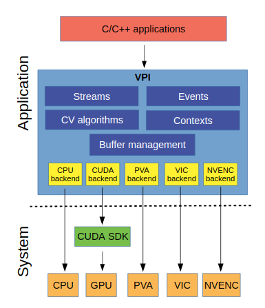
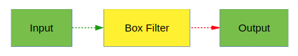
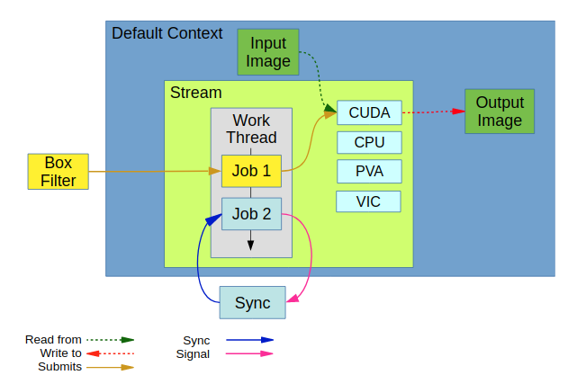

# Nvidia Developement

## NVIDIA Isaac Sim

> Isaac Sim is a *robotics simulation application* and *synthetic data generation tool*. Within Isaac Sim, you can program, train and test any robot design. The simulation environment enables the creation of photorealistic worlds filled with specific objects that the robot can interact with.


**New Features**

- Multi-Camera Support
- Fisheye Camera with Synthetic Data
- ROS2 Support
- PTC Onshape Importer
- Improved Sensor Support
  - Ultrasonic Sensor
  - Force Sensor
  - Custom Lidar Patterns
- Downloadable from NVIDIA Omniverse Launcher

**Synthetic Data Generation**

> Isaac Sim has built-in support for a variety of sensor types that are important in training perception models. These sensors include RGB, depth, bounding boxes, and segmentation.

> Output synthetic data in the KITTI format. This data can then be used directly with the NVIDIA Transfer Learning Toolkit to enhance model performance with use case-specific data.

[more](https://developer.nvidia.com/blog/nvidia-isaac-sim-on-omniverse-now-available-in-open-beta/)

[webinar link](https://www.nvidia.com/en-us/on-demand/session/gtcspring21-s31824/)

---

## NVIDIA VPI

> NVIDIA VPI is a library that abstracts heterogeneous video stream computing on NVIDIA embedded devices. VPI provides a common API to use various hardware modules for accelerating computer vision applications. 

> VPI supports the backends CPU, GPU (using CUDA), PVA (Programmable Vision Accelerator), VIC (Video and Image Compositor) and NVENC(Video encoder engine). 


| Backend | Device/platform |
|---------| ----------------|
| CPU | All devices on x86 (linux) and Jetson aarch64 platforms |
| CUDA | All devices on x86 (linux) with a Maxwell or superior NVIDIA GPU, and Jetson aarch64 platforms |
| PVA | All Jetson AGX Xavier series and Jetson Xavier NX devices |
| VIC | All Jetson devices. |
| NVENC | All Jetson devices. Noting that nvenc that has dense optical flow is only supported on Jetson AGX Xavier series. |




**New Features**
- Support for different processing backends
- VPI allows a combination of different backends in the same processing pipeline.
- Zero copy, shared memory mapping interface to manage data between the different backends.
- The API is designed to minimize initial memory allocations typically required just at the starting stage of many computer vision algorithms.
- OpenCV and EGL interoperability.
- Synchronization mechanisms that are agnostic of the backend being used.


**Jetpack**

Path: `/opt/nvidia/vpi/vpi-0.1`

**Example**



python
```python
import vpi
input = vpi.Image((640,480), vpi.Format.U8)
with vpi.Backend.CUDA:
    output = input.box_filter(3)
```

c++
```cpp
#include <vpi/Image.h>
#include <vpi/Stream.h>
#include <vpi/algo/BoxFilter.h>

int main()
{
    VPIImage input, output;
    vpiImageCreate(640, 480, VPI_IMAGE_FORMAT_U8, 0, &input);
    vpiImageCreate(640, 480, VPI_IMAGE_FORMAT_U8, 0, &output);

    //Create a stream to execute the algorithm. 
    VPIStream stream;
    vpiStreamCreate(0, &stream);
    
    //Submit the box filter algorithm to the stream
    vpiSubmitBoxFilter(stream, VPI_BACKEND_CUDA, input, output, 3, 3, VPI_BORDER_CLAMP);
    
    //Wait until the stream finishes processing.
    vpiStreamSync(stream);
    
    //Destroy created objects.
    vpiStreamDestroy(stream);
    vpiImageDestroy(input);
    vpiImageDestroy(output);
 
    return 0;
}
   
```

Conceptual structure:



[more](https://docs.nvidia.com/vpi/architecture.html)

[nvidia-blog](https://developer.nvidia.com/blog/reducing-temporal-noise-on-images-with-vpi-on-jetson-embedded-computers/)
