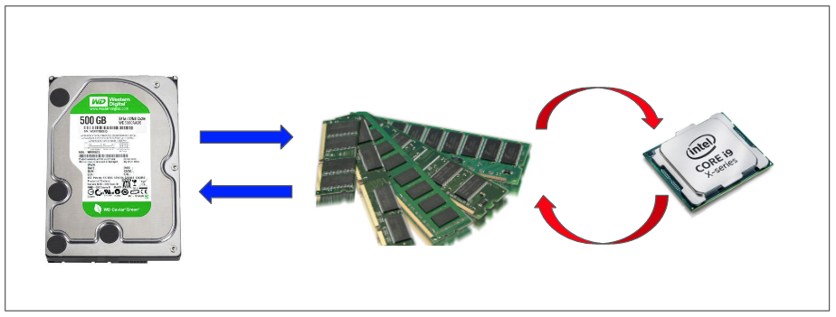

# Linux

## htop
- PID: process ID number.
- USER: process owner.
- PRI: process priority by the kernel.
- NI: process priority reset by the user or root.
- VIR: virtual memory the process is consuming.
- RES: physical memory the process is consuming.
- SHR: shared memory that the process is consuming.
- S: current process state.
- CPU%: percentage of CPU that the process is consuming.
- MEM%: percentage of memory that the process is consuming.
- TIME+: time measured in clock ticks since process execution started.
- Command: name of the command that started the process

### Useful Shortcut Keys

`u`: displays all processes owned by a particular user.

`p`: sort processes on high CPU consumption.

`m`: sort processes on high memory consumption.

`t`: sort process on time.

`Space`: tag a process

`c`: tag a process and child processes

`Shift + u`: remove all tags.

`Shift + f`: highlight and follow a process.

`Shift + h`: show/hide user and kernel processes.

`a`: set what CPU cores a process can access.

`i`: set IO priority.

`h`: help menu.


## History Command
```bash
fc -l <start> <end> | grep "docker"
# fc -l 4630 4810 | grep "docker"
```

## Network 

Check used port
```bash
sudo netstat -pna | grep 8888
# or
netstat -anv | grep LISTEN
```

### UDP CLI Test Tool

#### Establish Connection
Server Side:
```bash
nc -u -l 9999
```
`9999` is server-side port

`-u` is udp protocol

Client Side:
```bash
nc -u 192.168.0.100 9999
```
`192.168.0.100` is server IP

`9999` is server port

#### Check Connection

```bash
netstat | grep 9999
```

#### Send Package 
In client side, send: 
```bash
"Hi server!"
```
In Server side, send:
```bash
"hi, client"
```

[more](https://linuxhint.com/send_receive_udp_packets_linux_cli/)

### Check Network Latency

<details>
  <summary>Linux 网络延迟</summary>
  谈到网络延迟（Network Latency），人们通常认为它是指网络数据传输所需的时间。但是，这里的“时间”是指双向流量，即数据从源发送到目的地，然后从目的地地址返回响应的往返时间：RTT（Round-Trip Time）。除了网络延迟之外，另一个常用的指标是应用延迟（Application Latency），它是指应用接收请求并返回响应所需的时间。通常，应用延迟也称为往返延迟，它是网络数据传输时间加上数据处理时间的总和。

  通常人们使用 ping 命令来测试网络延迟，ping 是基于 ICMP 协议的，它通过计算 ICMP 发出的响应报文和 ICMP 发出的请求报文之间的时间差来获得往返延迟时间。这个过程不需要特殊的认证，从而经常被很多网络攻击所利用，如，端口扫描工具 nmap、分组工具 hping3 等。

  因此，为了避免这些问题，很多网络服务都会禁用 ICMP，这使得我们无法使用 ping 来测试网络服务的可用性和往返延迟。在这种情况下，您可以使用 traceroute 或 hping3 的 TCP 和 UDP 模式来获取网络延迟。

</details>

tool 1: 
```bash
# -c: 3 requests  
# -S: Set TCP SYN  
# -p: Set port to 80  
$ hping3 -c 3 -S -p 80 google.com  
HPING google.com (eth0 142.250.64.110): S set, 40 headers + 0 data bytes  
len=46 ip=142.250.64.110 ttl=51 id=47908 sport=80 flags=SA seq=0 win=8192 rtt=9.3 ms  
len=46 ip=142.250.64.110 ttl=51 id=6788  sport=80 flags=SA seq=1 win=8192 rtt=10.9 ms  
len=46 ip=142.250.64.110 ttl=51 id=37699 sport=80 flags=SA seq=2 win=8192 rtt=11.9 ms  
--- baidu.com hping statistic ---  
3 packets transmitted, 3 packets received, 0% packet loss  
round-trip min/avg/max = 9.3/10.9/11.9 ms  
```

tool 2: 
```bash
$ traceroute --tcp -p 80 -n google.com  
traceroute to google.com (142.250.190.110), 30 hops max, 60 byte packets  
 1  * * *  
 2  240.1.236.34  0.198 ms * *  
 3  * * 243.254.11.5  0.189 ms  
 4  * 240.1.236.17  0.216 ms 240.1.236.24  0.175 ms  
 5  241.0.12.76  0.181 ms 108.166.244.15  0.234 ms 241.0.12.76  0.219 ms  
 ...  
24  142.250.190.110  17.465 ms 108.170.244.1  18.532 ms 142.251.60.207  18.595 ms  
```

> traceroute 会在路由的每一跳（hop）发送三个数据包，并在收到响应后输出往返延迟。如果没有响应或响应超时（默认 5s），将输出一个星号 *


[reference](https://blog.devgenius.io/linux-troubleshoot-network-latency-a6da740f5cb8)

## deb package

```console
$ dpkg -i package.deb #安装/更新一个 deb 包
$ dpkg -r package_name #从系统删除一个 deb 包
$ dpkg -l #显示系统中所有已经安装的 deb 包
$ dpkg -l | grep httpd #显示所有名称中包含 "httpd" 字样的deb包
$ dpkg -s package_name #获得已经安装在系统中一个特殊包的信息
$ dpkg -L package_name #显示系统中已经安装的一个deb包所提供的文件列表
$ dpkg --contents package.deb #显示尚未安装的一个包所提供的文件列表
$ dpkg -S /bin/ping #确认所给的文件由哪个deb包提供
#APT 软件工具 (Debian, Ubuntu 以及类似系统)
$ apt-get install package_name #安装/更新一个 deb 包
$ apt-cdrom install package_name #从光盘安装/更新一个 deb 包
$ apt-get update #升级列表中的软件包
$ apt-get upgrade #升级所有已安装的软件
$ apt-get remove package_name #从系统删除一个deb包
$ apt-get check #确认依赖的软件仓库正确
$ apt-get clean #从下载的软件包中清理缓存
$ apt-cache search searched-package #返回包含所要搜索字符串的软件包名称
```

## tree

-L 2: Depth 2  
```console
$ tree -L 2 -N /
```

Only show directories:
```console
$ tree -L 2 -d -N /
```

no indentation + full path
```console
$ tree -L 2 -d -fi -N /
```

[reference](https://www.lesstif.com/lpt/linux-tree-54952142.html)

## strace
strace is a debug tool which helps you to debug your APP.

save tracing message to .txt:
```console
$ strace -o debug.txt yourApp
```

check system  calls:
```console
$ strace -c yourApp
```

Extracting info by specific keyword, like `open`:
```console
$ strace -e open yourApp
```

Tracing by timestamp:
```console
$ strace -t yourApp
```

## ltrace

lib trace tool
```console
$ ltrace -t yourApp
```

## Find Biggest Files and Directories in Linux

```console
$  du -a /your_dir | sort -n -r | head -n 5
```
du command: Estimate file space usage.
a : Displays all files and folders.
sort command : Sort lines of text files.
-n : Compare according to string numerical value.
-r : Reverse the result of comparisons.
head : Output the first part of files.
-n : Print the first ‘n’ lines. (In our case, We displayed first 5 lines).

**Human Readable Format**
```console
$ du -hs * | sort -rh | head -5
```
 
**Display the largest folders/files including the sub-directories** 
```console
$ du -Sh | sort -rh | head -5
```
du command: Estimate file space usage.
-h : Print sizes in human readable format (e.g., 10MB).
-S : Do not include size of subdirectories.
-s : Display only a total for each argument.
sort command : sort lines of text files.
-r : Reverse the result of comparisons.
-h : Compare human readable numbers (e.g., 2K, 1G).
head : Output the first part of files.

**Total files' number** 
```console
find . -mindepth 1 -maxdepth 1 | wc -l
```

### ls command

find 5 most-recently modified files
```console
$ ls -1t | head -5
```

last 5 modified files
```console
$ ls -1t | tail -5
```

## softlink and hardlink

**create soft link**
```console
$ ln -s {source-filename} {symbolic-filename}
```

**verify**
```console
$ ls -l file1 link1
```

**overwrite symlinks/Soft link**
```console
$ ln -f -s file link
```

**unlink**
```console
$ unlink symlink_name
```
or 
```console
$ rm symlink_name
```

**file numbers in a directory**
```bash
ls | wc -l
```


[reference](https://www.cyberciti.biz/faq/creating-soft-link-or-symbolic-link/)
## find command

```console
$ find /dir -name keyword
```

## cat command

Print 5 lines:
```console
$ head -n 5 my.txt
```

print with line number:
```console
$ cat -n my.txt
```

Generate a yaml file

```bash
export AWS_CLUSTER_NAME=kubeflow-demo-msp
export AWS_REGION=us-west-2
export K8S_VERSION=1.19
export EC2_INSTANCE_TYPE=m5.large
```

```bash
cat << EOF > cluster.yaml
---
apiVersion: eksctl.io/v1alpha5
kind: ClusterConfig

metadata:
  name: ${AWS_CLUSTER_NAME}
  version: "${K8S_VERSION}"
  region: ${AWS_REGION}

managedNodeGroups:
- name: kubeflow-mng
  desiredCapacity: 3
  instanceType: ${EC2_INSTANCE_TYPE}
EOF
```
check 

```bash
cat cluster.yaml
```

## ffmpeg

Resize Video:
```console
$ ffmpeg -i input_video.mp4 -s 640x480 -c:a copy out.mp4
```

Extract frame in a video(every 10 frames):
```console
$ ffmpeg -i out.mp4 -vf "select=not(mod(n\,10))" -vsync vfr -q:v 2 img_%05d.jpg
```

change file format:
```console
$ ffmpeg -i out.mp4 -c copy sample.h264
```

cut video:
```console
$ ffmpeg -ss 00:01:26 -t 00:01:52 -i dog.mp4 -acodec copy -vcodec copy -async 1 cut.mp4
```

An image to a video:
```console
$ ffmpeg -loop 1 -i sample.jpg -c:v libx264 -t 5 -pix_fmt yuv420p -vf "pad=ceil(iw/2)*2:ceil(ih/2)*2"  out.mp4
```

jpg images to a video
```bash
$ ffmpeg -r 1/5 -f concat -i list.txt -c:v libx264 -r 25 -pix_fmt yuv420p -t 15 out.mp4
```

[more](https://hamelot.io/visualization/using-ffmpeg-to-convert-a-set-of-images-into-a-video/)
[more](https://stackoverflow.com/questions/30121222/convert-all-images-in-directory-to-mp4-using-ffmpeg-and-a-timestamp-order)


Change video file pixel format
```bash
# Using the format filter (yuv420p)
ffmpeg -i in_file -filter:v "format=yuv420p" out_file

# Using the 'pix_fmt' option
ffmpeg -i in_file -pix_fmt yuv420p out_file
```

### re-encoding
```bash
ffmpeg -i a.mp4 -c:v libx264 -crf 18 -preset slow -c:a copy output.mp4
```


### Stack Videos

Horizontal Stack:
```bash
ffmpeg -i input0.mp4 -i input1.mp4 -filter_complex hstack=inputs=2 horizontal-stacked-output.mp4
```

Vertical Stack:
```bash
ffmpeg -i input0.mp4 -i input1.mp4 -filter_complex vstack=inputs=2 vertical-stack-output.mp4
```

2×2 Grid of Videos:
```bash
ffmpeg \
-i input0.mp4 -i input1.mp4 -i input2.mp4 -i input3.mp4 \
-filter_complex \
"[0:v][1:v]hstack=inputs=2[top]; \
[2:v][3:v]hstack=inputs=2[bottom]; \
[top][bottom]vstack=inputs=2[v]" \
-map "[v]" \
finalOutput.mp4
```

3×2 Grid of Videos:
```bash
ffmpeg \
-i input0.mp4 -i input1.mp4 \
-i input2.mp4 -i input3.mp4 \
-i input4.mp4 -i input5.mp4 \
-filter_complex \
"[0:v][1:v][2:v]hstack=inputs=3[top];\
[3:v][4:v][5:v]hstack=inputs=3[bottom];\
[top][bottom]vstack=inputs=2[v]" \
-map "[v]" \
finalOutput.mp4
```


### concat videos

concat demuxer:
```console
$ cat mylist.txt
file '/path/to/file1'
file '/path/to/file2'
file '/path/to/file3'
    
$ ffmpeg -f concat -safe 0 -i mylist.txt -c copy output.mp4
```
[reference](https://stackoverflow.com/questions/7333232/how-to-concatenate-two-mp4-files-using-ffmpeg)

rotate video:
```console
$ ffmpeg -i "in.mp4" -metadata:s:v "rotate=90" -c copy "out.mp4"
```
or
```console
# rotate 90 degree
#0 = 90CounterCLockwise and Vertical Flip (default)
#1 = 90Clockwise
#2 = 90CounterClockwise
#3 = 90Clockwise and Vertical Flip
# -vf "transpose=2,transpose=2" for 180 degrees.

$ ffmpeg -i in.mov -vf "transpose=1" out.mov
```


Resize image:
```console
$ ffmpeg -i input.jpg -vf scale=320:240 output_320x240.png
```
or 
```console
$ ffmpeg -i input.jpg -vf scale=320:-1 output_320x240.png
```

Add image to video:
```console
# tl=(5,5)
$ ffmpeg -i input.mp4 -i logo.png -filter_complex "overlay=5:5" -codec:a copy output.mp4
```
[more](https://stackoverflow.com/questions/10918907/how-to-add-transparent-watermark-in-center-of-a-video-with-ffmpeg)


Convert 10-bit H.265 to 10-bit H.264
```console
$ ffmpeg -i input -c:v libx264 -crf 18 -c:a copy output.mkv
```

- `-crf 18` appear visually lossless

- `-crf 0`  lossless mode


Convert 10-bit H.265 to 8-bit H.265
```console
$ ffmpeg -i input -c:v libx265 -vf format=yuv420p -c:a copy output.mkv
```

Convert 10-bit H.265 to 8-bit H.264
```console
$ ffmpeg -i input -c:v libx264 -crf 18 -vf format=yuv420p -c:a copy output.mkv
```

### video to GIF
Generate color_palette.png
```bash
 $ ffmpeg -i sample.mp4 -filter_complex "[0:v] palettegen" color_palette.png
```
Generate GIF file:
```bash
$ ffmpeg -i sample.mp4 -i color_pallet.png -filter_complex "[0:v][1:v] paletteuse" -r 10 -s 640x360  my_gif_file.gif
```
[more](https://www.fosslinux.com/45389/gif-maker-apps-linux.htm)


## Shell Script

**Array**

arr=(1 2 3)

array size: `${#arr[@]}`

arr[0] element: `${arr[0]}`

array's all items: `${arr[*]}` or `${arr[@]}` 

arr[0] element size: `${#arr[0]}`


**User Input**

Input command: `read -p 'name: ' uservar`

Silient input command: `read -sp 'name: ' uservar`


**Get IP last Number**

```
var=123.444.888.235
new_var="${var%.*}.0"
```
[reference](https://unix.stackexchange.com/questions/250740/replace-string-after-last-dot-in-bash)

**if else**
```
if [condition];then
    # do something
elif [condition];then
    # do something
else
    # do something
fi    
```

**Replace String's Character**

solution 1: Use `tr`

E.g. Replace `192.168.0.111` to `192_168_0_111`

```console
$ server_ip=192.168.0.111
$ echo "$server_ip" | tr . _
```

Result: 
```
192_168_0_111
```

solution 2: Use bash expansion
```console
$ server_ip=192.168.0.111
$ result=${server_ip//[.]/_}
```

Result: 
```
192_168_0_111
```

More usage:

Only replace first match char:
```
${string/substring/replacement}
```
Replace all match chars:
```
${string//substring/replacement}
```

**Change IP In Terminal**

Sample:
```console
$ sudo ifconfig eth0 192.168.0.1 netmask 255.255.255.0
```


**Find Top 10 Largest File/Directories**

In terminal:
```console
$ sudo du -a /var | sort -n -r | head -n 10
```

**Check Disk Usage**
```bash
df -h /var/lib/docker
```

### Disk Mount

driver check
```
sudo fdisk -l
```

Format a disk
```
# sudo mkfs -t ext4 /dev/sda
```

Disk mount
```
# sudo mkdir /dev/hdd
# sudo mount /dev/sda /dev/hdd
# sudo chmod 777 /dev/hdd
```

Auto mount after booting
```
sudo vim /etc/fstab
# 파일 밑에 아래 줄 추가
#/dev/sda /dev/hdd ext4 defaults 0 0
```

check mount
```
df -h
```


---
## tr command

> **tr** is a command line utility for translating or deleting characters.

**Replace character: tr -c**

There are string1=aaabbbccc, string2=ab:
```console
$ echo -n "aaabbbccc" | tr -c ab k
```
result:
```
aaabbbkkk
```

**Delete repeated characters: tr -s**

There are string1=aaabbbccc:
```console
$ echo -n "aaabbbccc" | tr -s '[a-z]'
```
result:
```
abc
```

**Delete Characters: tr -d**

There are string1=aaabbbccc:
```console
$ echo -n "aaabbbccc" | tr -d bbb
```
result:
```
aaaccc
```

**Replace lowercase to uppercase**
```console
$  echo aaabbbccc | tr '[a-z]' '[A-Z]'
```
result:
```
AAABBBCCC
```


## Chown Command

Change File or Folder's Owner 

### Check Folder or File's Owner

```console
$ ls -lt
```

sample result:
```
drwxr-xr-x   2 root root       4096 Jan 15 23:34 foo
```

### Change Owner To Specific User

```console
$ sudo chown user1:user1 <file>
```
sample:
```console
$ sudo chown wendy:wendy foo
```

Or use User ID:
```console
$ chown 1000:1000 foo.txt
``` 

Check User ID:
```console
$ id
```
sample result:
```
uid=1000(wendy) gid=1000(wendy) groups=1000(wendy),4(adm),20(dialout),24(cdrom),27(sudo),30(dip),46(plugdev),116(lpadmin),126(sambashare)
```

**Change To Root**
```console
$ sudo chown root foo
```

**Change Group To Root**
```console
$ sudo chown :root foo
```

**Chaner Folder's Owner**
```console
$ chown -R wendy:wendy foo-folder
```

---
https://miseon119.github.io/whylearn.github.io/test/images/git-workflow-diagram3.png

---

## SSH Config Setting

### SSH Config File Sample

Common Remote Control Command via SSH:
```console
$ sudo ssh Jane@192.168.0.1 
```

If you want to SSH your remote PC by short command such as 'ssh JanePC', or you control many remote PCs.
Maybe you need this 'config' file instead. It usually locates in `~/.ssh/config`. If not, create one.

Sample config file:
```
Host JanePC 
    HostName 192.168.0.1
    User Jane

Host BillPC 
    HostName 192.168.0.2
    User Bill

```
After saving the config file, and then open terminal type `ssh JanePC`. 
You can access `Jane@192.168.0.1`.

---

### SSH X11 Forwarding

**Server PC Requirement:**

Step 1: 
```console
$ sudo apt-get install xauth
```
Step 2: Modify `/etc/ssh/sshd_config` file
```
X11Forwarding yes
```

**Client PC Requirement:**

Step 1: vim `~/.ssh/config`, add `ForwardX11 yes`

Sample config
```
 Host JanePC 
    HostName 192.168.0.1
    User Jane

Host BillPC 
    HostName 192.168.0.2
    User Bill

 Host *
  ForwardX11 yes
```

Step 2: Test 
```console
ssh -X Jane@192.168.0.1
```
```console
$ gedit
```

---

### SSH Remote Control Without Password

Step 1: Generate public key
```console
$ ssh-keygen
```
This will create `id_rsa.pub` key under `~/.ssh/` directory.

Step 2: Copy the key around remote PC
```console
$ ssh-copy-id -i .ssh/id_rsa.pub Jane@192.168.0.1
```

Step 3: Test
```console
$ ssh Jane@192.168.0.1
```

[More SSH Config Reference](http://man.openbsd.org/OpenBSD-current/man5/ssh_config.5#ForwardX11).

---

###  Enable Or Disable X11 Forwarding in SSH server

Modify sshd configuration file:
```console
$ sudo vim /etc/ssh/sshd_config
```

Search `X11Forwarding`:
```
X11Forwarding no
```

Reload or restart SSH server service:
```console
$ sudo systemctl restart sshd
```

[Reference](https://www.simplified.guide/ssh/enable-x11-forwarding)

---

##  Swap Memory

> In Linux OS, whenever RAM has an insufficient amount of memory to hold a process, it borrows some amount of memory from the secondary storage to store its inactive content. Here, the borrowed space from the hard disk is called **Swap Memory**.
> Linux swap is a very useful way to extend the RAM. Because it provides the necessary additional memory when RAM space has been exhausted and a process has to be continued. 



Pros:

- Swap saves from crashes
- It can easily hold those inactive blocks of RAM that are hardly used once or twice and then they are never used. The freed up RAM can then be used to hold more programs that have a higher priority

Cons:

- Swap is slower than RAM. Adding a swap space won't make your computer faster, it will only help to overcome some limitations posed by the RAM size.

> The safest: RAM = SWAP

| RAM     | SWAP     |
| ------- | -------- |
| < 1Gb   | 2Gb      |
| 2-4Gb   | 2-4Gb    |
| 8Gb     | 4Gb      |

### Check Swap Command

```console
$ swapon
```

```note
For reference, see: https://linuxhint.com/swap_memory_linux/
```

### Cut Command

Cut text's words by specific colume

```console
 cut -c 5- < file1.txt > file2.txt
```
- [5-] cut start point which is 5th character.

file1.txt
```
aaaaabbbbbccccc
```
after hitting command:

file2.txt
```
abbbbbccccc
```

### zip command

zip a directory but exclude some directories:
```console
$ zip -r zip_file_name foo -x "foo/dir1/*" "foo/dir2/*"
```

### uname

Linux Kernel Name
```console
$ uname -s
```

Linux Kernel release
```console
$ uname -r
```

Get Machine Architecture
```console
$ uname --m
```

Processor Type
```console
$ uname -p
```

---

## Port-Forwarding

Set port-forwarding 3030 to 3030
```bash
sudo iptables -t nat -A PREROUTING -i eth0 -p tcp --dport 3030 -j REDIRECT --to-port 3030
```

Check port-forwarding
```bash
sudo iptables -t nat -L --line-numbers
```
Delete port-forwarding
```bash
sudo iptables -t nat -D PREROUTING 3
```
"3" is displayed in second command.

## Terminal Setting

### Install Terminator

```console
$ sudo apt-get install terminator
```

### Set Default Terminal

```console
$ sudo update-alternatives --config x-terminal-emulator
```

---

## Troubleshooting

### apt-get update error

Detailed error message
```bash
W: An error occurred during the signature verification. The repository is not updated and the previous index files will be used. GPG error: https://apt.kitware.com/ubuntu focal InRelease: The following signatures couldn't be verified because the public key is not available: NO_PUBKEY 6AF7F09730B3F0A4
W: Failed to fetch https://apt.kitware.com/ubuntu/dists/focal/InRelease  The following signatures couldn't be verified because the public key is not available: NO_PUBKEY 6AF7F09730B3F0A4
W: Some index files failed to download. They have been ignored, or old ones used instead.

```

solution
```bash
sudo apt-key adv --keyserver keyserver.ubuntu.com --recv-keys  6AF7F09730B3F0A4
```

### remmina codec error Ubuntun 18.04

```console
$ sudo apt-add-repository ppa:remmina-ppa-team/remmina-next
$ sudo apt update
$ sudo apt install remmina remmina-plugin-rdp remmina-plugin-secret
$ sudo killall remmina
```
restart remmina

### Docker Container

#### Gtk-WARNING **: cannot open display: :x.0

Add `-v /tmp/.X11-unix:/tmp/.X11-unix -e DISPLAY=unix$DISPLAY` option

#### ImportError: libGL.so.1: cannot open shared object file: No such file or director

e.g. unbuntu 18.04 docker
```bash
apt-get update
apt-get -y install libgl1-mesa-glx
```

### dpkg 

Error:
**E: Sub-process /usr/bin/dpkg returned an error code (1)**
when install a package.

Solution:
```console
$ sudo rm -r /var/lib/dpkg/info/*
$ sudo dpkg --configure -a
$ sudo apt update -y
```

### Can not open settings
Solution:
```console
$ sudo apt-get remove gnome-control-center
$ sudo apt autoremove
$ sudo apt-get install gnome-control-center
```

### System Settings Can't Open in Ubuntu 18.04

```console
$ sudo apt-get remove gnome-control-center
$ sudo apt autoremove
$ sudo apt-get install gnome-control-center
```

---

### journalctl command
retrieving messages from the last boot:
```bash
 journalctl -b -1
```

To list the boots of the system:
```bash
journalctl --list-boots
```

#### Time Ranges
```bash
journalctl --since "1 hour ago"
journalctl --since "2 days ago"
journalctl --since "2015-06-26 23:15:00" --until "2015-06-26 23:20:00"
```

#### By Unit

To see messages logged by any systemd unit, use the -u switch. The command below will show all messages logged by the Nginx web server. You can use the --since and --until switches here to pinpoint web server errors occurring within a time window.

```bash
journalctl -u nginx.service
journalctl -u nginx.service -u mysql.service
```
#### Follow or Tail

```bash
 journalctl -u mysql.service -f
 journalctl -n 50 --since "1 hour ago"
```

The -r parameter shows journal entries in reverse chronological order, so the latest messages are printed first. 

```bash
 journalctl -u sshd.service -r -n 1
```

#### Output Formats

```bash
 journalctl -u apache2.service -r -o json-pretty
```
[more](https://www.loggly.com/ultimate-guide/using-journalctl/)


### Check Service log
```console
$ journalctl -u service-name.service
```

for the current boot:
```console
$ journalctl -u service-name.service -b
```
[reference1](https://sysops.tistory.com/115)

[reference2](https://www.digitalocean.com/community/tutorials/how-to-use-journalctl-to-view-and-manipulate-systemd-logs)

[log reference](https://www.loggly.com/ultimate-guide/python-logging-basics/)


###  /var/log/ File Too Large

Check Error Log:
```console
$ tail -f /var/log/syslog
```

Clearing the `/var/log/syslog` file:
```console
$ sudo cat /dev/null > /var/log/syslog
```

### Reset PATH

```console
$ source /etc/environment 
```
```console
$ echo PATH
```


### apt-get update failed

In some cases, update error like this:
> Err:11 http://ppa.launchpad.net/inameiname/stable/ubuntu bionic Release   
  404  Not Found [IP: 91.189.95.85 80]

It mentioned `inameiname` message in this error.

**Solution**

Step 1:
```console
$  cd /etc/apt/sources.list.d/
```

Step 2: Check your `.list` files:
```console
$ ls -l
```
In my case, it's similar like this:
```
user@user:/etc/apt/sources.list.d$ ls -l
total 36
-rw-r--r-- 1 root root  71 Dec 29 10:34 gazebo-stable.list
-rw-r--r-- 1 root root  71 Dec 29 10:34 gazebo-stable.list.save
-rw-r--r-- 1 root root 189 Dec 29 10:34 google-chrome.list
-rw-r--r-- 1 root root 189 Dec 29 10:34 google-chrome.list.save
-rw-r--r-- 1 root root 138 Dec 29 10:34 inameiname-ubuntu-stable-bionic.list
-rw-r--r-- 1 root root 338 Dec 29 10:34 nvidia-container-runtime.list
-rw-r--r-- 1 root root 336 Dec 29 10:34 nvidia-container-runtime.list.save
-rw-r--r-- 1 root root 193 Dec 29 10:34 vscode.list
-rw-r--r-- 1 root root 193 Dec 29 10:34 vscode.list.save
```

`-rw-r--r-- 1 root root 138 Dec 29 10:34 inameiname-ubuntu-stable-bionic.list` this file maybe caused error.

Step 3:
```console
$ sudo rm inameiname-ubuntu-stable-bionic.list
```

Step 4:
```console
$ sudo apt-get update
```

### Serial port permission denied errors

> This is because the device file of the serial port does not have permissions to allow to currently logged in user to “read” or “write” to the serial device. 

Confirm device user:
```console
$ ls -l /dev/ttyUSB*
```

verify if the user does belong to the dialout group
```console
$ id -Gn Jane
```

add the user to the “dialout” supplementary group
```console
$ sudo usermod -a -G dialout <username>
```

logout and login, try the “id” command:
```console
$ id -Gn Jane
```
[more](https://websistent.com/fix-serial-port-permission-denied-errors-linux/)

---

## dpkg common commands

**Install package**
```console
$ sudo dpkg -i your.deb
```

**Search installed package**
```console
$  sudo dpkg -l pkg_name
```
or 
```console
$  sudo dpkg --list pkg_name
```

```console
$ dpkg -l | grep part_of_pkgName
```

**remove**
```console
$ sudo dpkg --remove pkg_name
```
and 
```console
$  sudo dpkg --purge pkg_name
```

---

## email

```bash
sudo apt-get install mailutils
mkfifo /var/spool/postfix/public/pickup
service postfix restart
 echo "Message Body Here" | mail -s "Subject Here" user@example.com -A backup.zip
```


---

## youtube-dl

Download FHD video
```bash
youtube-dl  -f 137  https://www.youtube.com/watch\?v\=8SVrydUA6oU
```

--- 

## GStreamer

### Preinstallation

```console
$ sudo apt-get install v4l-utils
```

**Check v4l devices**
```console
$ v4l2-ctl --list-devices
```

**Check supported format**
```console
$ v4l2-ctl -d /dev/video0 --list-formats-ext
```

**Check connected devices**
```console
$ v4l2-ctl --list-formats-ext
```

### Commands

**Hello World**
```console
$ gst-launch-1.0 videotestsrc ! 'video/x-raw, width=(int)1280, height=(int)720, format=(string)I420, framerate=(fraction)30/1' ! nveglglessink -e
```

#### vl4 device

Simple display
```console
$  gst-launch-1.0 v4l2src ! xvimagesink
```
or
```console
$ gst-launch-1.0 -ev v4l2src device=/dev/video1 ! xvimagesink
```

#### Save As .mp4

Using h264 codec:
```console
$ gst-launch-1.0 videotestsrc ! 'video/x-raw, width=(int)1280, height=(int)720, format=(string)I420, framerate=(fraction)30/1' ! omxh264enc ! 'video/x-h264, stream-format=(string)byte-stream' ! h264parse ! qtmux ! filesink location=test.mp4 -e

```

#### Read video file

Read `.mp4` and decodeing:
```console
$ gst-launch-1.0 filesrc location=test.mp4 ! qtdemux name=demux ! h264parse ! omxh264dec ! nveglglessink -e
```

#### Read webcam and encoding stream
```console
$ gst-launch-1.0 v4l2src device=/dev/video1 ! decodebin ! videoconvert ! omxh264enc ! h264parse ! omxh264dec ! nveglglessink -e
```

#### RTP Streaming

Send to host port 5000:
```console
$ gst-launch-1.0 v4l2src device=/dev/video1 ! decodebin ! videoconvert ! omxh264enc ! video/x-h264, stream-format=byte-stream ! rtph264pay ! udpsink host=127.0.0.1 port=5000
```

Receive Streaming:
```console
$ gst-launch-1.0 udpsrc port=5000 ! application/x-rtp, encoding-name=H264, payload=96 ! rtph264depay ! h264parse ! omxh264dec ! nveglglessink -e
```

#### Jpg image processing

```bash
gst-launch-1.0 multifilesrc location=img_%06d.jpg caps=image/jpeg,framerate=30/1 ! jpegdec ! videoconvert ! jpegenc ! multifilesink location=jpgs/img_post_%06d.jpg
```
