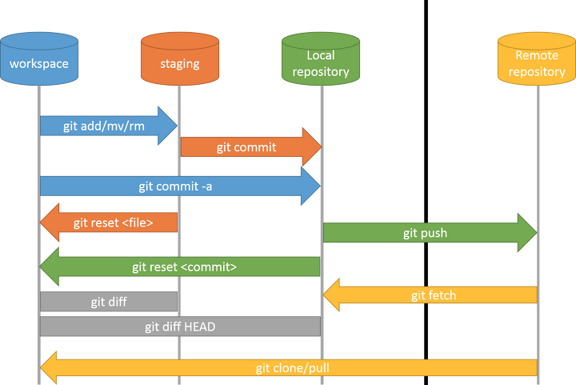

# Linux

## strace
strace is a debug tool which helps you to debug your APP.

save tracing message to .txt:
```console
$ strace -o debug.txt yourApp
```

check system  calls:
```console
$ strace -c yourApp
```

Extracting info by specific keyword, like `open`:
```console
$ strace -e open yourApp
```

Tracing by timestamp:
```console
$ strace -t yourApp
```

## ltrace

lib trace tool
```console
$ ltrace -t yourApp
```

## Find Biggest Files and Directories in Linux

```console
$  du -a /your_dir | sort -n -r | head -n 5
```
du command: Estimate file space usage.
a : Displays all files and folders.
sort command : Sort lines of text files.
-n : Compare according to string numerical value.
-r : Reverse the result of comparisons.
head : Output the first part of files.
-n : Print the first ‘n’ lines. (In our case, We displayed first 5 lines).

**Human Readable Format**
```console
$ du -hs * | sort -rh | head -5
```
 
**Display the largest folders/files including the sub-directories** 
```console
$ du -Sh | sort -rh | head -5
```
du command: Estimate file space usage.
-h : Print sizes in human readable format (e.g., 10MB).
-S : Do not include size of subdirectories.
-s : Display only a total for each argument.
sort command : sort lines of text files.
-r : Reverse the result of comparisons.
-h : Compare human readable numbers (e.g., 2K, 1G).
head : Output the first part of files.

**Total files' number** 
```console
find . -mindepth 1 -maxdepth 1 | wc -l
```

### ls command

find 5 most-recently modified files
```console
$ ls -1t | head -5
```

last 5 modified files
```console
$ ls -1t | tail -5
```

## softlink and hardlink

**create soft link**
```console
$ ln -s {source-filename} {symbolic-filename}
```

**verify**
```console
$ ls -l file1 link1
```

**overwrite symlinks/Soft link**
```console
$ ln -f -s file link
```

**unlink**
```console
$ unlink symlink_name
```
or 
```console
$ rm symlink_name
```


[reference](https://www.cyberciti.biz/faq/creating-soft-link-or-symbolic-link/)
## find command

```console
$ find /dir -name keyword
```

## cat command

Print 5 lines:
```console
$ head -n 5 my.txt
```

print with line number:
```console
$ cat -n my.txt
```

## ffmpeg

Resize Video:
```console
$ ffmpeg -i input_video.mp4 -s 640x480 -c:a copy out.mp4
```

Extract frame in a video(every 10 frames):
```console
$ ffmpeg -i out.mp4 -vf "select=not(mod(n\,10))" -vsync vfr -q:v 2 img_%05d.jpg
```

change file format:
```console
$ ffmpeg -i out.mp4 -c copy sample.h264
```

cut video:
```console
$ ffmpeg -ss 00:01:26 -t 00:01:52 -i dog.mp4 -acodec copy -vcodec copy -async 1 cut.mp4
```

### concat videos

concat demuxer:
```console
$ cat mylist.txt
file '/path/to/file1'
file '/path/to/file2'
file '/path/to/file3'
    
$ ffmpeg -f concat -safe 0 -i mylist.txt -c copy output.mp4
```
[reference](https://stackoverflow.com/questions/7333232/how-to-concatenate-two-mp4-files-using-ffmpeg)

rotate video:
```console
$ ffmpeg -i "in.mp4" -metadata:s:v "rotate=90" -c copy "out.mp4"
```
or
```console
# rotate 90 degree
#0 = 90CounterCLockwise and Vertical Flip (default)
#1 = 90Clockwise
#2 = 90CounterClockwise
#3 = 90Clockwise and Vertical Flip
# -vf "transpose=2,transpose=2" for 180 degrees.

$ ffmpeg -i in.mov -vf "transpose=1" out.mov
```


Resize image:
```console
$ ffmpeg -i input.jpg -vf scale=320:240 output_320x240.png
```
or 
```console
$ ffmpeg -i input.jpg -vf scale=320:-1 output_320x240.png
```

Add image to video:
```console
# tl=(5,5)
$ ffmpeg -i input.mp4 -i logo.png -filter_complex "overlay=5:5" -codec:a copy output.mp4
```
[more](https://stackoverflow.com/questions/10918907/how-to-add-transparent-watermark-in-center-of-a-video-with-ffmpeg)


Convert 10-bit H.265 to 10-bit H.264
```console
$ ffmpeg -i input -c:v libx264 -crf 18 -c:a copy output.mkv
```

- `-crf 18` appear visually lossless

- `-crf 0`  lossless mode


Convert 10-bit H.265 to 8-bit H.265
```console
$ ffmpeg -i input -c:v libx265 -vf format=yuv420p -c:a copy output.mkv
```

Convert 10-bit H.265 to 8-bit H.264
```console
$ ffmpeg -i input -c:v libx264 -crf 18 -vf format=yuv420p -c:a copy output.mkv
```


## Shell Script

**Array**

arr=(1 2 3)

array size: `${#arr[@]}`

arr[0] element: `${arr[0]}`

array's all items: `${arr[*]}` or `${arr[@]}` 

arr[0] element size: `${#arr[0]}`


**User Input**

Input command: `read -p 'name: ' uservar`

Silient input command: `read -sp 'name: ' uservar`


**Get IP last Number**

```
var=123.444.888.235
new_var="${var%.*}.0"
```
[reference](https://unix.stackexchange.com/questions/250740/replace-string-after-last-dot-in-bash)

**if else**
```
if [condition];then
    # do something
elif [condition];then
    # do something
else
    # do something
fi    
```

**Replace String's Character**

solution 1: Use `tr`

E.g. Replace `192.168.0.111` to `192_168_0_111`

```console
$ server_ip=192.168.0.111
$ echo "$server_ip" | tr . _
```

Result: 
```
192_168_0_111
```

solution 2: Use bash expansion
```console
$ server_ip=192.168.0.111
$ result=${server_ip//[.]/_}
```

Result: 
```
192_168_0_111
```

More usage:

Only replace first match char:
```
${string/substring/replacement}
```
Replace all match chars:
```
${string//substring/replacement}
```

**Change IP In Terminal**

Sample:
```console
$ sudo ifconfig eth0 192.168.0.1 netmask 255.255.255.0
```


**Find Top 10 Largest File/Directories**

In terminal:
```console
$ sudo du -a /var | sort -n -r | head -n 10
```

---
## tr command

> **tr** is a command line utility for translating or deleting characters.

**Replace character: tr -c**

There are string1=aaabbbccc, string2=ab:
```console
$ echo -n "aaabbbccc" | tr -c ab k
```
result:
```
aaabbbkkk
```

**Delete repeated characters: tr -s**

There are string1=aaabbbccc:
```console
$ echo -n "aaabbbccc" | tr -s '[a-z]'
```
result:
```
abc
```

**Delete Characters: tr -d**

There are string1=aaabbbccc:
```console
$ echo -n "aaabbbccc" | tr -d bbb
```
result:
```
aaaccc
```

**Replace lowercase to uppercase**
```console
$  echo aaabbbccc | tr '[a-z]' '[A-Z]'
```
result:
```
AAABBBCCC
```


## Chown Command

Change File or Folder's Owner 

### Check Folder or File's Owner

```console
$ ls -lt
```

sample result:
```
drwxr-xr-x   2 root root       4096 Jan 15 23:34 foo
```

### Change Owner To Specific User

```console
$ sudo chown user1:user1 <file>
```
sample:
```console
$ sudo chown wendy:wendy foo
```

Or use User ID:
```console
$ chown 1000:1000 foo.txt
``` 

Check User ID:
```console
$ id
```
sample result:
```
uid=1000(wendy) gid=1000(wendy) groups=1000(wendy),4(adm),20(dialout),24(cdrom),27(sudo),30(dip),46(plugdev),116(lpadmin),126(sambashare)
```

**Change To Root**
```console
$ sudo chown root foo
```

**Change Group To Root**
```console
$ sudo chown :root foo
```

**Chaner Folder's Owner**
```console
$ chown -R wendy:wendy foo-folder
```

---
https://miseon119.github.io/whylearn.github.io/test/images/git-workflow-diagram3.png
## Git

### git workflow



```console
# workspace -> staging
$ git add <file/dir>

# staging -> local repo
$ git commit -m "some info"

# local repo -> remote repo, local master to remote origin
$ git push origin master
```

```console
# workspace <- staging
$ git checkout -- <file>

# staging <- local repo
$ git reset HEAD <file>

# local repo <- remote repo
$ git clone <git_url>  
$ git fetch upstream master # 拉取远程代码到本地但不应用在当前分支
$ git pull upstream master   # 拉取远程代码到本地但应用在当前分支
$ git pull --rebase upstream master  # 如果平时使用rebase合并代码则加上
```

```console
# workspace <- local repo
$ git reset <commit>          # 本地仓库覆盖到工作区(保存回退文件内容修改)
$ git reset --mixed <commit>  # 本地仓库覆盖到工作区(保存回退文件内容修改)
$ git reset --soft <commit>   # 本地仓库覆盖到工作区(保留修改并加到暂存区)
$ git reset --hard <commit>   # 本地仓库覆盖到工作区(不保留修改直接删除掉)
```

#### git user info

```console
$ git config --global user.name "your_name"
$ git config --global user.email "your_email"
```


###  Git Basic Commands

**Commit**
```console
$ git commit -m "your note"
```

**Modify Commit Message**
```console
$ git commit -m “new message” - -amend
```

**Add Remote Repository**
```console
$ git remote add origin {remote repository Address}
```

**Add**
```console
$ git add .
```

**Push**
```console
$ git push origin {branch name}
```
eg. branch name is master or main.

**Initialize repo**
```console
$ git init
```

#### branch

Check remote repo branch:
```console
$ git branch -r
```

create branch:
```console
$ git branch dev
```

move to branch:
```console
$ git checkout dev
```

create and move to branch:
```console
$ git checkout -b dev
```

delete branch:
```console
$ git branch -d dev
```

push branch:
```console
git push -u origin test
```

---

## SSH Config Setting

### SSH Config File Sample

Common Remote Control Command via SSH:
```console
$ sudo ssh Jane@192.168.0.1 
```

If you want to SSH your remote PC by short command such as 'ssh JanePC', or you control many remote PCs.
Maybe you need this 'config' file instead. It usually locates in `~/.ssh/config`. If not, create one.

Sample config file:
```
Host JanePC 
    HostName 192.168.0.1
    User Jane

Host BillPC 
    HostName 192.168.0.2
    User Bill

```
After saving the config file, and then open terminal type `ssh JanePC`. 
You can access `Jane@192.168.0.1`.

---

### SSH X11 Forwarding

**Server PC Requirement:**

Step 1: 
```console
$ sudo apt-get install xauth
```
Step 2: Modify `/etc/ssh/sshd_config` file
```
X11Forwarding yes
```

**Client PC Requirement:**

Step 1: vim `~/.ssh/config`, add `ForwardX11 yes`

Sample config
```
 Host JanePC 
    HostName 192.168.0.1
    User Jane

Host BillPC 
    HostName 192.168.0.2
    User Bill

 Host *
  ForwardX11 yes
```

Step 2: Test 
```console
ssh -X Jane@192.168.0.1
```
```console
$ gedit
```

---

### SSH Remote Control Without Password

Step 1: Generate public key
```console
$ ssh-keygen
```
This will create `id_rsa.pub` key under `~/.ssh/` directory.

Step 2: Copy the key around remote PC
```console
$ ssh-copy-id -i .ssh/id_rsa.pub Jane@192.168.0.1
```

Step 3: Test
```console
$ ssh Jane@192.168.0.1
```

[More SSH Config Reference](http://man.openbsd.org/OpenBSD-current/man5/ssh_config.5#ForwardX11).

---

###  Enable Or Disable X11 Forwarding in SSH server

Modify sshd configuration file:
```console
$ sudo vim /etc/ssh/sshd_config
```

Search `X11Forwarding`:
```
X11Forwarding no
```

Reload or restart SSH server service:
```console
$ sudo systemctl restart sshd
```

[Reference](https://www.simplified.guide/ssh/enable-x11-forwarding)

---

##  Swap Memory

> In Linux OS, whenever RAM has an insufficient amount of memory to hold a process, it borrows some amount of memory from the secondary storage to store its inactive content. Here, the borrowed space from the hard disk is called **Swap Memory**.
> Linux swap is a very useful way to extend the RAM. Because it provides the necessary additional memory when RAM space has been exhausted and a process has to be continued. 


Pros:

- Swap saves from crashes
- It can easily hold those inactive blocks of RAM that are hardly used once or twice and then they are never used. The freed up RAM can then be used to hold more programs that have a higher priority

Cons:

- Swap is slower than RAM. Adding a swap space won't make your computer faster, it will only help to overcome some limitations posed by the RAM size.

> The safest: RAM = SWAP

| RAM     | SWAP     |
| ------- | -------- |
| < 1Gb   | 2Gb      |
| 2-4Gb   | 2-4Gb    |
| 8Gb     | 4Gb      |

### Check Swap Command

```console
$ swapon
```

```note
For reference, see: https://linuxhint.com/swap_memory_linux/
```

### Cut Command

Cut text's words by specific colume

```console
 cut -c 5- < file1.txt > file2.txt
```
- [5-] cut start point which is 5th character.

file1.txt
```
aaaaabbbbbccccc
```
after hitting command:

file2.txt
```
abbbbbccccc
```

### zip command

zip a directory but exclude some directories:
```console
$ zip -r zip_file_name foo -x "foo/dir1/*" "foo/dir2/*"
```

### uname

Linux Kernel Name
```console
$ uname -s
```

Linux Kernel release
```console
$ uname -r
```

Get Machine Architecture
```console
$ uname --m
```

Processor Type
```console
$ uname -p
```

---

## Troubleshooting

### dpkg 

Error:
**E: Sub-process /usr/bin/dpkg returned an error code (1)**
when install a package.

Solution:
```console
$ sudo rm -r /var/lib/dpkg/info/*
$ sudo dpkg --configure -a
$ sudo apt update -y
```


### System Settings Can't Open in Ubuntu 18.04

```console
$ sudo apt-get remove gnome-control-center
$ sudo apt autoremove
$ sudo apt-get install gnome-control-center
```

---

### Check Service log
```console
$ journalctl -u service-name.service
```

for the current boot:
```console
$ journalctl -u service-name.service -b
```
[reference1](https://sysops.tistory.com/115)

[reference2](https://www.digitalocean.com/community/tutorials/how-to-use-journalctl-to-view-and-manipulate-systemd-logs)

[log reference](https://www.loggly.com/ultimate-guide/python-logging-basics/)


###  /var/log/ File Too Large

Check Error Log:
```console
$ tail -f /var/log/syslog
```

Clearing the `/var/log/syslog` file:
```console
$ sudo cat /dev/null > /var/log/syslog
```

### apt-get update failed

In some cases, update error like this:
> Err:11 http://ppa.launchpad.net/inameiname/stable/ubuntu bionic Release   
  404  Not Found [IP: 91.189.95.85 80]

It mentioned `inameiname` message in this error.

**Solution**

Step 1:
```console
$  cd /etc/apt/sources.list.d/
```

Step 2: Check your `.list` files:
```console
$ ls -l
```
In my case, it's similar like this:
```
user@user:/etc/apt/sources.list.d$ ls -l
total 36
-rw-r--r-- 1 root root  71 Dec 29 10:34 gazebo-stable.list
-rw-r--r-- 1 root root  71 Dec 29 10:34 gazebo-stable.list.save
-rw-r--r-- 1 root root 189 Dec 29 10:34 google-chrome.list
-rw-r--r-- 1 root root 189 Dec 29 10:34 google-chrome.list.save
-rw-r--r-- 1 root root 138 Dec 29 10:34 inameiname-ubuntu-stable-bionic.list
-rw-r--r-- 1 root root 338 Dec 29 10:34 nvidia-container-runtime.list
-rw-r--r-- 1 root root 336 Dec 29 10:34 nvidia-container-runtime.list.save
-rw-r--r-- 1 root root 193 Dec 29 10:34 vscode.list
-rw-r--r-- 1 root root 193 Dec 29 10:34 vscode.list.save
```

`-rw-r--r-- 1 root root 138 Dec 29 10:34 inameiname-ubuntu-stable-bionic.list` this file maybe caused error.

Step 3:
```console
$ sudo rm inameiname-ubuntu-stable-bionic.list
```

Step 4:
```console
$ sudo apt-get update
```

---

## dpkg common commands

**Install package**
```console
$ sudo dpkg -i your.deb
```

**Search installed package**
```console
$  sudo dpkg -l pkg_name
```
or 
```console
$  sudo dpkg --list pkg_name
```

```console
$ dpkg -l | grep part_of_pkgName
```

**remove**
```console
$ sudo dpkg --remove pkg_name
```
and 
```console
$  sudo dpkg --purge pkg_name
```
