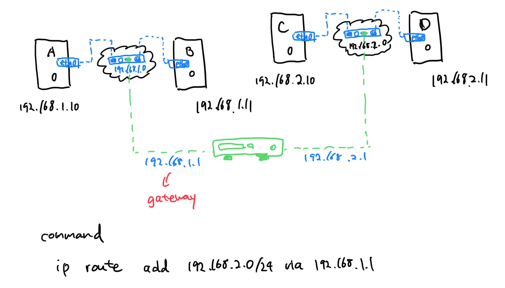
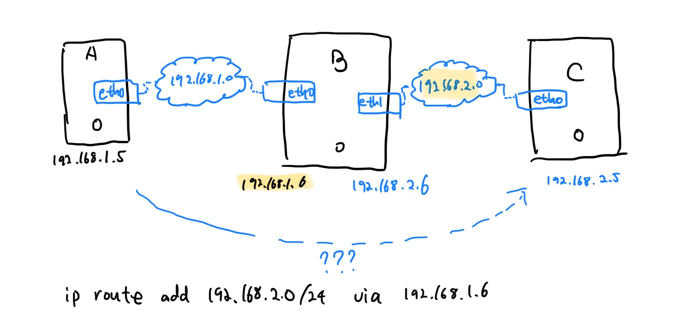

# Kubernetes

## What is Kubernetes?

Open source container orchestration tool. It helps manage containerized applications in different deployment environments.

Features:

- High availability or no downtime
- Scalability or high performance
- Disaster recovery(backup and restore)

## Command

Imperative
```bash
# Create Objects
kubectl run --image=nginx nginx
kubectl create deployment --image=nginx nginx
kubectl expose deployment nginx --port 80

# Update Objects
kubectl edit deployment nginx
kubectl scale deployment nginx --replicas=5
kubectl set image deployment nginx nginx=nginx:1.18

# use yaml files
kubectl create -f nginx.yaml
kubectl replace -f nginx.yaml
kubectl delete -f nginx.yaml
```

Declarative
```bash
kubectl apply -f nginx.yaml
```

Some options

`--dry-run` : By default as soon as the command is run, the resource will be created.

`--dry-run=client`: This will not create the resource, instead, tell you whether the resource can be created and if your command is right.

`-o yaml`: This will output the resource definition in YAML format on screen.

e.g.
```bash
kubectl run nginx --image=nginx --dry-run=client -o yaml
```

selector
```bash
kubectl get pods --selector app=App1
```

### namespace

```bash
 kubectl create namespace blue
 kubectl get namespace
# yaml
 kubectl create namespace green --dry-run -o yaml > green-ns.yaml
 kubectl create -f green-ns.yaml
 kubectl delete namespace xx
```

### config

```bash
 kubectl config view
 kubectl config set-context NAME --cluster=kubernetes xxx
 kubectl config use-context NAME
```
check cluster numbers
```bash
 kubectl config view
```
view a new kubeconfig file
```bash
 kubectl config view --kubeconfig=my-custom-config
```

check current context
```bash
kubectl config --kubeconfig=/root/my-kube-config current-context
```

use `research` context

```bash
kubectl config --kubeconfig=/root/my-kube-config use-context research
```


### label
```bash
kubectl get pods --show-labels
kubectl get pods -l <label_name>

# create and change
kubectl label pod <name> key=value
kubectl label pod <name> key=value --overwrite
# check 
kubectl label pod <name> --show-labels
# delete 
kubectl label pod <name> key-
```

### Node Affinity

Node Selector sample:
```yaml
spec:
  containers:
  - name: data_pro
    image: data_pro
  
  nodeSelector:
    size: Large

```

Affinity sample 1:
```yaml
spec:
  containers:
  - name: data_pro
    image: data_pro
    
  affinity:
    nodeAffinity:
      requiredDuringSchedulingIgnoredDuringExecution:
        nodeSelectorTerms:
        - matchExpressions:
          - key: size
            operator: In
            values:
            - Large
```

Affinity sample 2:
```yaml
spec:
  containers:
  - name: data_pro
    image: data_pro
    
  affinity:
    nodeAffinity:
      requiredDuringSchedulingIgnoredDuringExecution:
        nodeSelectorTerms:
        - matchExpressions:
          - key: size
            operator: NotIn
            values:
            - Small
```

### Static pods vs Daemonsets

Static Pods
- created by the kubelet
- Deploy control plane components as static pods
- Both ingnored by the Kube-Scheduler

DaemonSets
- Created by Kube-API server(DaemonSet Controller)
- Deploy Monitoring Agents, Logging Agents on nodes
- Both ingnored by the Kube-Scheduler


#### Get Static Pod Path

```bash
ps -ef |  grep /usr/bin/kubelet
```
e.g.
```plain
root@node01:/var/lib/kubelet#  ps -ef |  grep /usr/bin/kubelet 
root     21172     1  0 07:28 ?        00:00:17 /usr/bin/kubelet --bootstrap-kubeconfig=/etc/kubernetes/bootstrap-kubelet.conf --kubeconfig=/etc/kubernetes/kubelet.conf --config=/var/lib/kubelet/config.yaml --network-plugin=cni --pod-infra-container-image=k8s.gcr.io/pause:3.2
root     31913 25115  0 07:40 pts/0    00:00:00 grep --color=auto /usr/bin/kubelet
```

```bash
grep -i staticpod /var/lib/kubelet/config.yaml
```
e.g.
```plain
staticPodPath: /etc/just-to-mess-with-you
```

### Check Node CPU
```bash
kubectl top node --sort-by='cpu' --no-headers | head -1
```

### drain

- kubectl drain은 노드 관리를 위해서 지정된 노드에 있는 포드들을 다른곳으로 이동시키는 명령입니다.
- 우선 새로운 포드가 노드에 스케쥴링 되어서 실행되지 않도록 설정합니다.
- 그리고 나서 기존에 이 노드에서 실행중이던 포드들을 삭제합니다. 이 때 노드에 데몬셋으로 실행된 포드들이 있으면 drain이 실패합니다.
- 데몬셋으로 실행한 포드를 무시하고 진행하려면 `--ignore-daemonsets=true` 옵션을 주고 drain을 하면 됩니다.

```bash
 kubectl get nodes
 kubectl drain node01 --ignore-daemonsets=true

 ```

### cordon
 
 - kubectl cordon은 지정된 노드에 더이상 포드들이 스케쥴링되서 실행되지 않도록 합니다.

```bash
kubectl get nodes
kubectl cordon node01
kubectl uncordon node01
```

### upgrade K8S

```bash
apt update
apt install kubeadm=1.20.0-00
kubeadm upgrade apply v1.20.0
apt install kubelet=1.20.0-00
systemctl restart kubelet
```

### Backup

Backup Resource Configure
```bash
kubectl get all --all-namespaces -o yaml > all-deploy-svc.yaml
```

Backup ETCD
```bash
export ETCDCTL_API=3
etcdctl snapshot save snapshot.db

Service kubeapi-server stopped

etcdctl snapshot restore snapshot.db --data-dir=/var/lib/etcd-backup

systemctl daemon-reload
service etcd restart
```

ETCD version
```bash
kubectl logs etcd-controlplane -n kube-system
```

### Authenticate User

```bash
curl -v -k https://master-node-ip:6443/api/v1/pods -u "user1:password123"
```

#### static Password file
e.g. user-detail.csv
```bash
password123,user1,uid,grp
```

#### static Token file
e.g. user-token-details.csv, `--token-auth-file=user-token-details.csv`

```bash
KPJGDFSDFB123F,user1,uid,grp
```

curl command:
```bash
curl -v -k https://master-node-ip:6443/api/v1/pods --header "Authorization: Bearer KPJGDFSDFB123F"
```

### Generate private/public key
```bash
openssl genrsa -out my-bank.key 1024
openssl rsa -in my-bank.key -pubout > mybank.pem
```

### Certificate Authority

#### Generate Keys
```bash
openssl genrsa -out ca.key 2048
```

#### Certificate Signing Resquest
```bash
openssl req -new -key ca.key -subj "/CN=KUBERNETES-CA" -out ca.csr
```

#### Sign Certificates
```bash
openssl x509 -req -in ca.csr -signkey ca.key -out ca.crt
```

### authorization modes

Inspect the environment and identify the authorization modes configured on the cluster.
Check the `kube-apiserver` settings, look for `--authorization-mode`

```bash
kubectl describe pod kube-apiserver-controlplane -n kube-system
```
### View RBAC

```bash
kubectl get roles
kubectl get rolebindings
```

### Check Access

```bash
kubectl auth can-i create deployments
kubectl auth can-i create deployments --as dev-user
```

---

## Networking



Assign Address
```bash
ip addr add 192.168.1.10/24 dev eth0
```
```bash
ip link
```
Check route table
```bash
route
```

Add Route
```bash
ip route add 192.168.2.0/24 via 192.168.1.1
# another pc rout2 table
ip route add 192.168.1.0/24 via 192.168.2.1
```

### Set Linux Host As A Router



```bash
ip route add 192.168.2.0/24 via 192.168.1.6
ip route add 192.168.1.0/24 via 192.168.2.6
```
check ip forward
```bash
cat /proc/sys/net/ipv4/ip_forward
echo 1 > /proc/sys/net/ipv4/ip_forward
```
permanent change in `/etc/sysctl.conf` 
```plain
...
net.ipv4.ip_forward = 1
...
```


## Architecture

`Worker Nodes` refered as "Node"

`kubelet` refered as "node agent"


`APP Server` is Entrypoint to K8s cluster.

`Controller Manager` keeps track of what's happening in the cluster.

`Scheduler` ensures Pods placement.

`etcd` Kubernetes backing store.


## Main Components

Node: virtual or physical machine.

pod: Abstraction over container, a layer of top of the container  , usually 1 application per Pod.

service: set permanent IP address, Lifecycle of Pod and Service not connected


**Deployment** for stateless apps, **StatefulSet** for stateful Apps or Databases.


## Kubernetes Configuration


## Master Process


### What is a Namespace ?

- Organize resources in namespaces
- Virtual claster inside a cluster

check:
```bash
$ kubectl get namespace
```

using CLI to create namespace:
```bash
$ kubectl create namespace my-namespace
```

using yaml file to create namespace:
```plain
apiVersion: v1
kind: ConfigMap
metadata:
  name: mongodb-configmap
  namespace: my-namespace
data:
  database_url: mongodb-service
```
#### Why you should use namespace?

- Everything in one Namespace is terrible (e.g. multiple deployments, replicasets, services, configmaps)
- Resource grouped in Namespaces
- Conflicts(e.g. Many teams, sampe application)


- Resouce Sharing: Staging and Development
- Resouce Sharing: Blue/Green Deployment
- Access and Resource limits on Namespaces

Note:

- Each Namespace must define own ConfigMap


