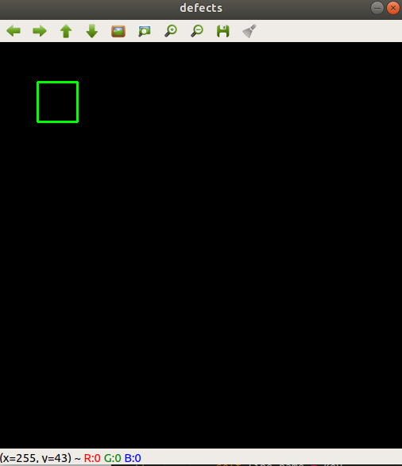

# OpenCV

## Read video

**Read Frame by key**

```python
import numpy as np
import cv2

cap = cv2.VideoCapture("out.mp4")
while(True):
    # Capture frame-by-frame
    ret, frame = cap.read()
    if not(ret):
    	break
	# red_img  = np.full((1080,1920,3), (0,0,255), np.uint8)
    cv2.imshow('frame',frame)
    key = cv2.waitKey(0)
    # show one frame at a time
    while key not in [ord('q'), ord('k')]:
        key = cv2.waitKey(0)
    # Quit when 'q' is pressed
    if key == ord('q'):
        break

# When everything done, release the capture
cap.release()
# outfile.release();
cv2.destroyAllWindows()
```

## Write Video

```python
import numpy as np
import cv2

cap = cv2.VideoCapture("out.mp4")
fourcc = cv2.VideoWriter_fourcc('D','I','V','X')
outfile = cv2.VideoWriter('test5.avi', fourcc, 21.0, (1920,1080))
while(True):
    # Capture frame-by-frame
    ret, frame = cap.read()
    if not(ret):
    	break
	# red_img  = np.full((1080,1920,3), (0,0,255), np.uint8)
    outfile.write(frame)
    cv2.imshow('frame',frame)
    key = cv2.waitKey(1)
    # Quit when 'q' is pressed
    if key == ord('q'):
        break

# When everything done, release the capture
cap.release()
outfile.release();
cv2.destroyAllWindows()
```

## Merge Two Frames

```python
#img == imread()
red_img = np.full((1080,1920,3), (0,0,255), np.uint8)
img_copy = cv2.addWeighted(src1=img, alpha=0.8, src2=red_img, beta=0.2, gamma=0)
```

## Bitwise Operation

AND:
```python
cv2.bitwise_and(img1, img2)
```
OR
```python
cv2.bitwise_or(img1, img2)
```
XOR
```python
cv2.bitwise_xor(img1, img2)
```
NOT
```python
cv2.bitwise_not(img1)
```

Binary image:
```python
src = cv2.imread("sample.jpg")
gray = cv2.cvtColor(src, cv2.COLOR_BGR2GRAY)
_, binary = cv2.threshold(gray, 127, 255, cv2.THRESH_BINARY)
and_img = cv2.bitwise_and(gray, binary)
```

### Find object's minimal Rectangle

Get minimal rectangle:
```python
rotate_rect = cv2.minAreaRect(array(obj_pts))
w = rotate_rect[1][0]
h = rotate_rect[1][1]
obj_center = rotate_rect[0]
angle = rotate_rect[2]
```
Get minimal rectangle points:
```python
rect_pts = cv2.boxPoints(rotate_rect)
```

---

## All about Contour

**Post-Processing Contour**

```python
x, y, w, h = cv2.boundingRect(contour)
```

Get minimum rectangle box(rotated box)
```python
rotateRect = cv2.minAreaRect(contour)
pts = cv2.boxPoints(rotateRect)  # rect 4-points
```

Get minimum circle
```python
center, radius = cv2.minEnclosingCircle(contour)
```

Get minimum triangle
```python
area, triangle = cv2.minEnclosingTriangle(points)
```
Get minimum ellipse
```python
ellipse = cv2.fitEllipse(points)
```
Get line which crosses object center
```python
line = cv2.fitLine(points, distType, param, reps, aeps, line)
```

[reference1](https://bkshin.tistory.com/entry/OpenCV-22-%EC%BB%A8%ED%88%AC%EC%96%B4Contour)
[reference2]https://hoony-gunputer.tistory.com/entry/OpenCV-python-Contour
[reference3]https://076923.github.io/posts/Python-opencv-21/

**countNonZero**

```python
obj_area = cv2.countNonZero(binary_img)
```

**Draw Contour**

`custom_roi_points` are user defined points, and we use `cv2.drawContours` to draw its contour.

```python
import numpy as np
import cv2
from numpy import array

img = np.zeros((512,512,3), np.uint8)
custom_roi_points = array([(50,50),(50,100),(100,100),(100,50)])

cv2.drawContours(img, [custom_roi_points], 0, (0,255,0), 2)
cv2.imshow('draw rect', img)
cv2.waitKey(0)
cv2.destroyAllWindows()
```
Result:



**Draw polygon line**
```python
img = cv2.polylines(img, [pts], False, blue, 2) # open type poylgon
img = cv2.polylines(img, [pts], True, blue, 2) # close type poylgon
```

**Draw Convex polygon**
```python
img = cv2.fillConvexPoly(img, [pts], blue) 
```


## Distance between polygon and points 

If you want to check a **point** inside or outside of a **polygon**, use `cv2.pointPolygonTest`:

sample code:   
```python
import cv2
import numpy as np

blank_image = np.zeros((720,1280,3), np.uint8)
custom_roi_points= np.array([(430,360),(860,360),(860,710),(430,710)]) 

dist = cv2.pointPolygonTest(custom_roi_points, (500,600),True)
cv2.circle(blank_image,(500,600),1,[255,0,0],7)
cv2.drawContours(blank_image,[custom_roi_points], 0, (0,255,255),2)

print("dist= " + str(dist))
cv2.imshow('img',blank_image)
cv2.waitKey(0)
cv2.destroyAllWindows()
```

## inshow setting

**Scalable Window Size**
```python
cv2.namedWindow("result", cv2.WINDOW_NORMAL) 
```

___
