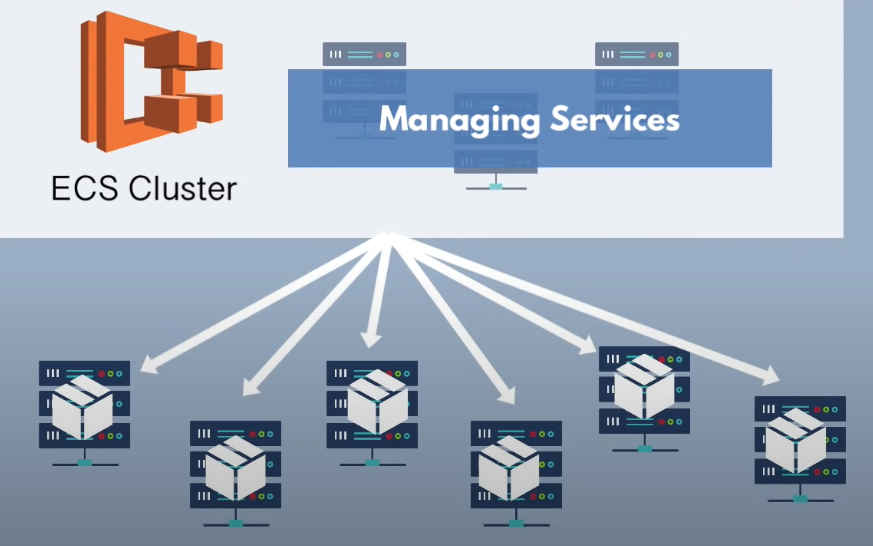
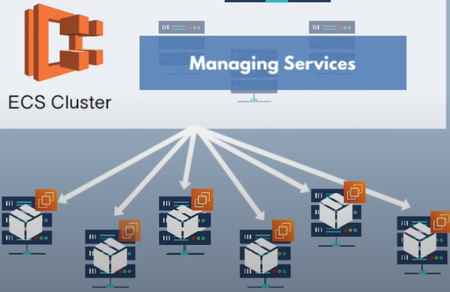
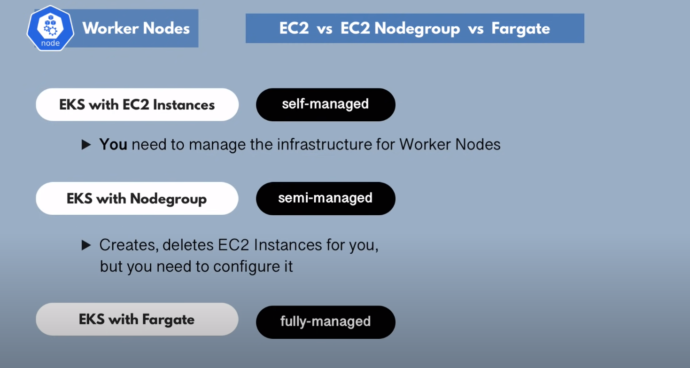

# AWS

## Container Orchestration Tools

> Container Orchestration Tools = Managing, scaling and deploying containers

- Docker Swarm
- Kubernetes
- Mesos
- Nomad
- ECS(AWS Elastic Container Service)

## What is ECS?

- Container Orchestration Service
- Manages the whole container lifecycle(start, re-schedule, load balance)

### How does ECS work?
 

Where are these containers hosted?

> ECS hosted onEC2 Instances

 But you still have to do:
 - [x] Create EC2 instances
 - [x] Join to ECS cluster
 - [x] Check resources
 - [x] Manage Operating System
 - [x] Docker Runtime, ECS Agent

## ECS with AWS Fargate

If you want AWS to manage both **Container Orchestration** and **Infrastructure Management**, here is AWS Fargate.

- Serverless way to launch containers

> Tell AWS, Here is my container, please run it.

Pros:
- [x] No need to provision and manage servers. 
- [x] on demand
- [x] Only the infrastructure resources needed to run your containers
- [x] pay only for what you use
- [x] Easily scales up/down without fixed resources defined before hand 

EC2 Instance Pricing: Pay for whole Server.

Fargate Pricing: How long and how much capacity.

## EKS (Elastic Kubernetes Service)

What if you want to use Kubernetes?

> Thankfully, AWS has EKS which manages Kubernetes cluster on AWS infrastructure.

Pros:
- [x] Easier to migrate to another platform. e.g. Google Cloud, MS Azure
- [x] Kubernetes is open-source
- [x] Large community 

