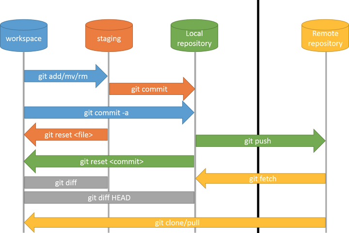

# Git

## git workflow



```console
# workspace -> staging
$ git add <file/dir>

# staging -> local repo
$ git commit -m "some info"

# local repo -> remote repo, local master to remote origin
$ git push origin master
```

```console
# workspace <- staging
$ git checkout -- <file>

# staging <- local repo
$ git reset HEAD <file>

# local repo <- remote repo
$ git clone <git_url>  
$ git fetch upstream master # 拉取远程代码到本地但不应用在当前分支
$ git pull upstream master   # 拉取远程代码到本地但应用在当前分支
$ git pull --rebase upstream master  # 如果平时使用rebase合并代码则加上
```

```console
# workspace <- local repo
$ git reset <commit>          # 本地仓库覆盖到工作区(保存回退文件内容修改)
$ git reset --mixed <commit>  # 本地仓库覆盖到工作区(保存回退文件内容修改)
$ git reset --soft <commit>   # 本地仓库覆盖到工作区(保留修改并加到暂存区)
$ git reset --hard <commit>   # 本地仓库覆盖到工作区(不保留修改直接删除掉)
```

### git user info

```console
$ git config --global user.name "your_name"
$ git config --global user.email "your_email"
$ git config --list
```


##  Git Basic Commands

**Commit**
```console
$ git commit -m "your note"
```

**Modify Commit Message**
```console
$ git commit -m “new message” - -amend
```

**Add Remote Repository**
```console
$ git remote add origin {remote repository Address}
```

**Add**
```console
$ git add .
```

**Push**
```console
$ git push origin {branch name}
```
eg. branch name is master or main.

**Initialize repo**
```console
$ git init
```

**fetch**

The **git fetch** command is used to download the contents from a remote repository. **git pull** directly changes your local working copy of a repository.

git서버에서 최신 코드 받아오기

```console
$ git fetch 
```

### branch

Check remote repo branch:
```console
$ git branch -r
```

create branch:
```console
$ git branch dev
```

move to branch:
```console
$ git checkout dev
```

create and move to branch:
```console
$ git checkout -b dev
```

Delete branch locally:
```bash
$ git branch -d dev
```
Delete branch remotely
```bash
$ git push origin --delete remoteBranchName
```

push branch:
```console
git push -u origin test
```
[reference](https://pks2974.medium.com/%EC%9E%90%EC%A3%BC-%EC%82%AC%EC%9A%A9%ED%95%98%EB%8A%94-%EA%B8%B0%EC%B4%88-git-%EB%AA%85%EB%A0%B9%EC%96%B4-%EC%A0%95%EB%A6%AC%ED%95%98%EA%B8%B0-533b3689db81)

### Diff

Compare two branch file
```console
$ git diff mybranch2 master -- myfile.py
```
or 
```console
$ git diff branch1:path/to/file branch2:path/to/file
```
Compare local/remote branches:
```console
$ git diff <local branch> <remote>/<remote branch>
```
e.g.
```console
$ git diff myfile.py origin/myfile.py
```

### Clone

Clone branch
```console
$ git clone -b <branch> <remote_repo>
```

### Add submodule

Add
```bash
git submodule add <url> <path>
git submodule add -b <branch> <url> <path>
```

Update
```bash
git submodule update --init --recursive
git submodule update --init --remote <git repo>
```

Delete
```bash
git submodule deinit -f <git repo>
# e.g. git submodule deinit <module folder>
git rm --cached <git repo>
git commit -m "removed all submodules"
```

[more](https://www.csdn.net/tags/Mtzacg1sNTA5MS1ibG9n.html)

Common usage(which contains submodule)
```bash
git pull
git submodule update --recursive --remote
```

### filter-branch Usage

#### Change Author and Committer
```bash
git filter-branch --commit-filter '
export GIT_AUTHOR_EMAIL=me@example.com;
export GIT_AUTHOR_NAME=me;
export GIT_COMMITTER_EMAIL=me@example.com;
export GIT_COMMITTER_NAME=me;
git commit-tree "$@"
'
```
[more](https://manishearth.github.io/blog/2017/03/05/understanding-git-filter-branch/)
#### Delete files in history

```bash
git filter-branch --tree-filter 'rm -f passwords.txt' HEAD
```

```bash
//从指定的commit中删除误操作文件的记录
git filter-branch --tree-filter 'git rm -f --ignore-unmatch {{文件名}}' [commit1..commit2]

//从当前分支的前30次提交开始遍历,删除误操作文件的引用
git filter-branch --tree-filter 'git rm -f {{文件名}}' HEAD~30..HEAD
```
then, 
```bash
git push origin master --force
```

[solution 2:](https://stackoverflow.com/questions/43762338/how-to-remove-file-from-git-history) 
```bash
git filter-branch --index-filter \
    'git rm -rf --cached --ignore-unmatch path_to_file' HEAD
```

solution 3:
```bash
git filter-branch --tree-filter 'rm -f path/to/large/files' --tag-name-filter cat -- --all
git push origin --tags --force
git push origin --all --force
```

solution 4:
```bash
## 将其删除掉
$ git filter-branch \
    --force --prune-empty --index-filter \
    "git rm -rf --cached --ignore-unmatch YOU-FILE-NAME" \
    --tag-name-filter cat -- --all

## filter-branch:  重写Git仓库中的提交
## --index-filter: 指定后面命令进行删除
## --all:          所有分支的提交(位于/refs下的所有引用)

## 强制推送
$ git push --force --all

## 彻底清除
$ rm -rf .git/refs/original/
$ git reflog expire --expire=now --all
$ git gc --prune=now

```

#### Difference Between tree-filter and index-filter

> The short version is that --tree-filter checks out each commit into a temporary directory, runs your filter command, and builds a new commit from whatever is now in the temporary directory; while --index-filter copies each commit into the index, runs your filter command, and builds a new commit from whatever is now in the index.

> Copying a commit to the index is much1 faster than checking out the commit. Building a commit from the index is faster than building a commit from a directory. As a result, using the index filter is much faster than using the tree filter. It's not as easy to script for, though.

[more](https://stackoverflow.com/questions/36255221/what-is-the-difference-between-tree-filter-and-index-filter-in-the-git)


#### Search Large files in history
```bash
git rev-list --objects --all | grep -E `git verify-pack -v .git/objects/pack/*.idx | sort -k 3 -n | tail -10 | awk '{print$1}' | sed ':a;N;$!ba;s/\n/|/g'`
```

```bash
## 筛除前五个且保留第一列
$ git verify-pack \
    -v .git/objects/pack/*.idx | \
    sort -k 3 -n | tail -5 | awk '{print$1}'
```

```bash
## 查找出最大的5个文件和对应Commit信息
$ git rev-list --objects --all | \
    grep "$(git verify-pack -v .git/objects/pack/*.idx | \
    sort -k 3 -n | tail -5 | awk '{print$1}')"

## rev-list:    列出Git仓库中的所有提交记录
## --objects:   列出该提交涉及的所有文件ID
## --all:       所有分支的提交(位于/refs下的所有引用)
## verify-pack: 显示已打包的内容(找大文件)    
```

#### Big files Management
使用 migrate 命令优化 .git 目录
```bash
## 重写master分⽀
## 将历史提交(指的是.git目录)中的*.zip都⽤lfs进⾏管理
$ git lfs migrate import --include-ref=master --include="*.zip"

## 重写所有分⽀及标签
## 将历史提交(指的是.git目录)中的*.rar,*.zip都⽤lfs进⾏管理
$ git lfs migrate import --everything --include="*.rar,*.zip"

## 切换后需要把切换之后的本地分支提交到远程仓库了，需要手动push更新远程仓库中的各个分支
$ git lfs push --force

## 切换成功后，GIT仓库的大小可能并没有变化
## 主要原因可能是之前的提交还在，因此需要做一些清理工作
## 如果不是历史记录非常重要的仓库，建议不要像上述这么做，而是重新建立一个新的仓库
$ git reflog expire --expire-unreachable=now --all
$ git gc --prune=now
```

## git lfs
```bash
## 1.开启lfs功能
$ git lfs install

## 2.追踪所有后缀名为“.psd”的文件
$ git lfs track "*.iso"

## 3.追踪单个文件
git lfs track "logo.png"

## 4.提交存储信息文件
$ git add .gitattributes

## 5.提交并推送到GitHub仓库
$ git add .
$ git commit -m "Add some files"
$ git push origin master
```