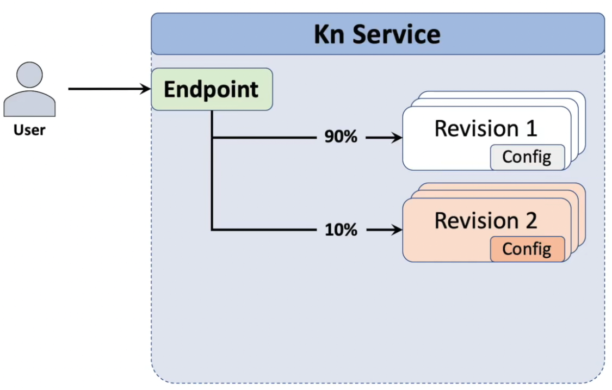
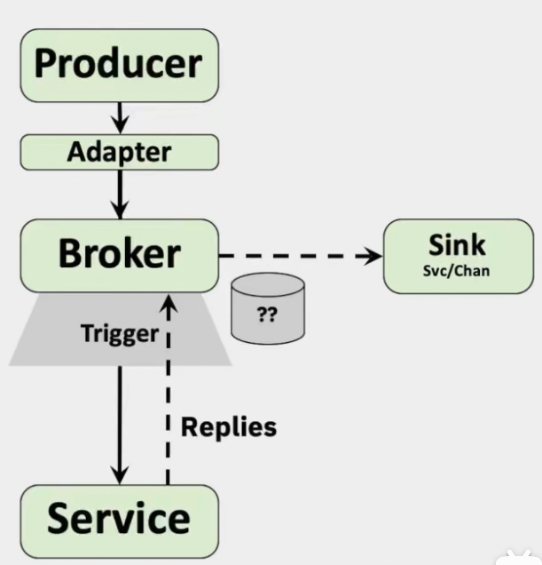
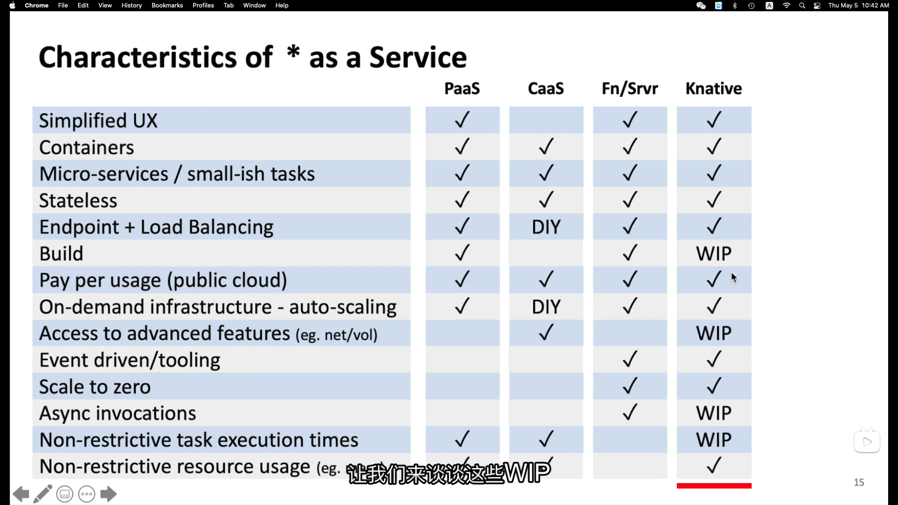

# KNative

## Introduction Knative

- An opinionated and simplified view of application/container management
- Allowing developers to focus on coding
- Built as an extension to K8s
- Building blocks on which Cloud Providers can build a platform

## Components

- **Serving** is the runtime component
- **Eventing** contains tools for managing events

### Knative Serving

- Deploy app as pod/revision
- Networking auto-setup
- Revisions are scaled up/down
- Updates create Revisions
- Traffic splitting based on %
- Dedicated URLs to Revisions

### Knative Eventing

- Manage the coordination/delivery of events

**Event Source** connects Event Producer to "sink"

1. Create the subscription for you
2. Create an Adapter(KnService) to receive the events and convert them into CloudEvents

**Broker** : A receiver of events. E.g. a queue

**Trigger** (subscription) ask for events from a Broker, 
 - Filters: to subset the stream of events often based on CloudEvent's metadata

### Service Comparison

