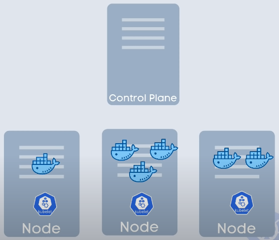
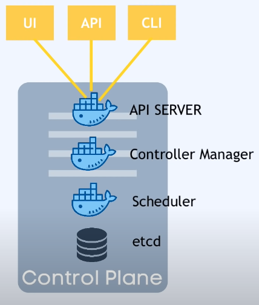
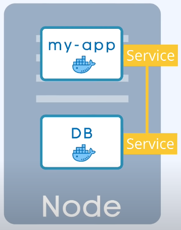
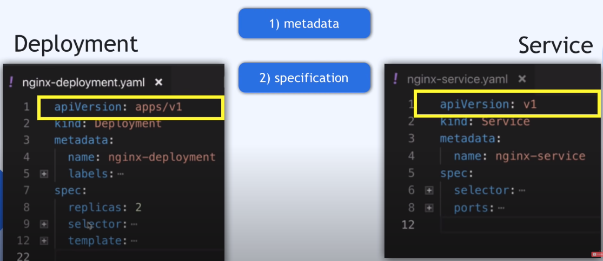

# Kubernetes

## What is Kubernetes?

Open source container orchestration tool. It helps manage containerized applications in different deployment environments.

Features:

- High availability or no downtime
- Scalability or high performance
- Disaster recovery(backup and restore)

## Architecture

`Worker Nodes` refered as "Node"

`kubelet` refered as "node agent"

`APC Server` is Entrypoint to K8s cluster.

`Controller Manager` keeps track of what's happening in the cluster.

`Scheduler` ensures Pods placement.

`etcd` Kubernetes backing store.

## Main Components

Node: virtual or physical machine.

pod: Abstraction over container, a layer of top of the container  , usually 1 application per Pod.

service: set permanent IP address, Lifecycle of Pod and Service not connected

**Deployment** for stateless apps, **StatefulSet** for stateful Apps or Databases.

## Kubernetes Configuration

