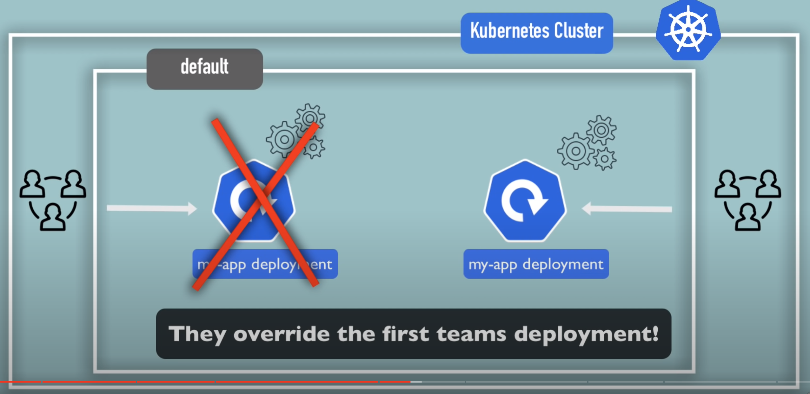

# Kubernetes

## What is Kubernetes?

Open source container orchestration tool. It helps manage containerized applications in different deployment environments.

Features:

- High availability or no downtime
- Scalability or high performance
- Disaster recovery(backup and restore)

## Command

Imperative
```bash
# Create Objects
kubectl run --image=nginx nginx
kubectl create deployment --image=nginx nginx
kubectl expose deployment nginx --port 80

# Update Objects
kubectl edit deployment nginx
kubectl scale deployment nginx --replicas=5
kubectl set image deployment nginx nginx=nginx:1.18

# use yaml files
kubectl create -f nginx.yaml
kubectl replace -f nginx.yaml
kubectl delete -f nginx.yaml
```

Declarative
```bash
kubectl apply -f nginx.yaml
```


## Architecture

`Worker Nodes` refered as "Node"

`kubelet` refered as "node agent"


`APP Server` is Entrypoint to K8s cluster.

`Controller Manager` keeps track of what's happening in the cluster.

`Scheduler` ensures Pods placement.

`etcd` Kubernetes backing store.


## Main Components

Node: virtual or physical machine.

pod: Abstraction over container, a layer of top of the container  , usually 1 application per Pod.

service: set permanent IP address, Lifecycle of Pod and Service not connected


**Deployment** for stateless apps, **StatefulSet** for stateful Apps or Databases.


## Kubernetes Configuration


## Master Process


### What is a Namespace ?

- Organize resources in namespaces
- Virtual claster inside a cluster

check:
```bash
$ kubectl get namespace
```

using CLI to create namespace:
```bash
$ kubectl create namespace my-namespace
```

using yaml file to create namespace:
```plain
apiVersion: v1
kind: ConfigMap
metadata:
  name: mongodb-configmap
  namespace: my-namespace
data:
  database_url: mongodb-service
```
#### Why you should use namespace?

- Everything in one Namespace is terrible (e.g. multiple deployments, replicasets, services, configmaps)
- Resource grouped in Namespaces
- Conflicts(e.g. Many teams, sampe application)



- Resouce Sharing: Staging and Development
- Resouce Sharing: Blue/Green Deployment
- Access and Resource limits on Namespaces

Note:

- Each Namespace must define own ConfigMap


